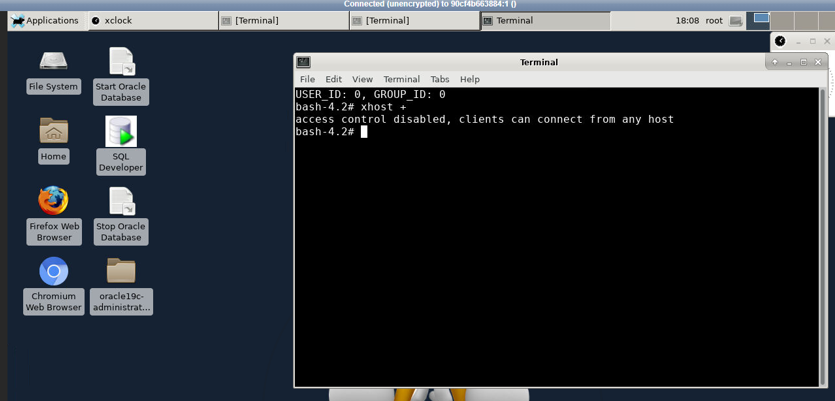
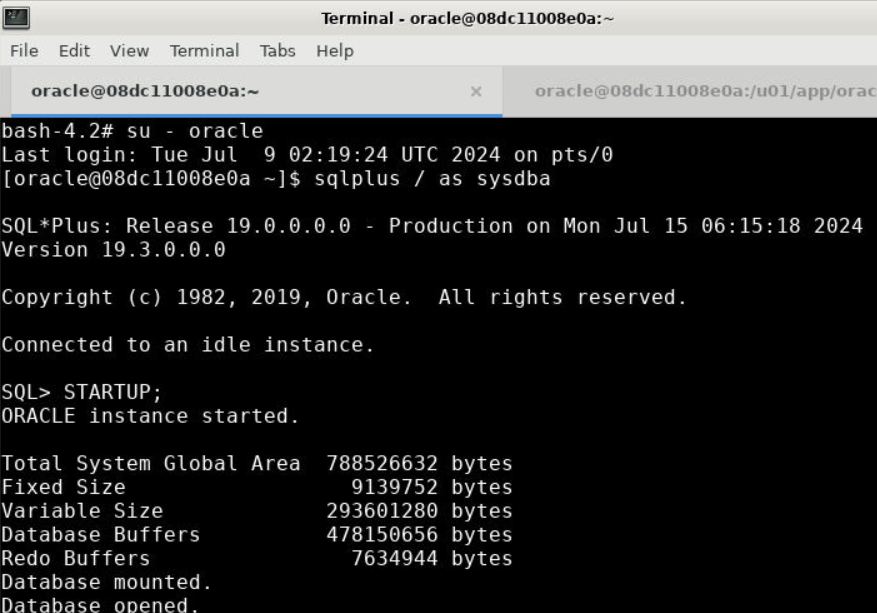
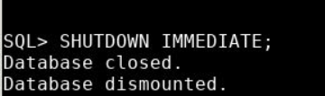
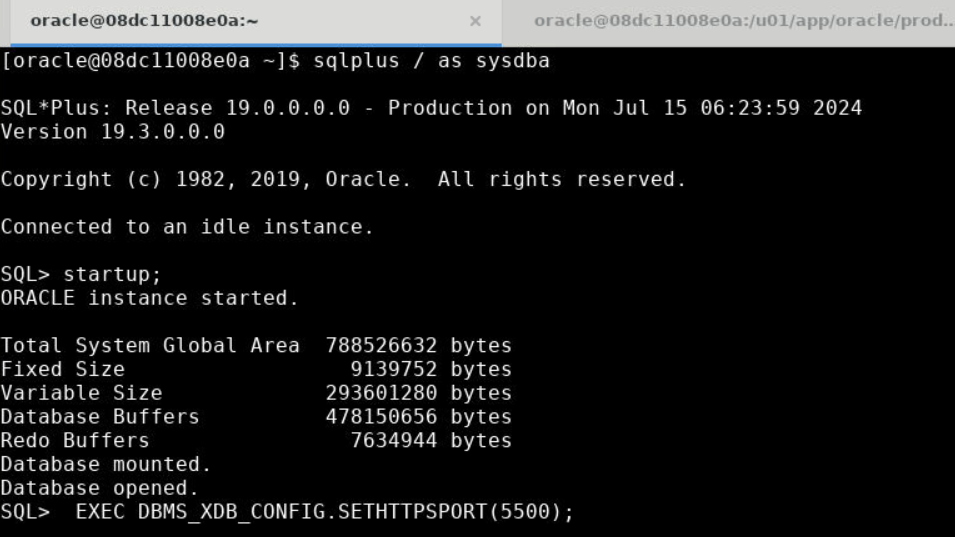
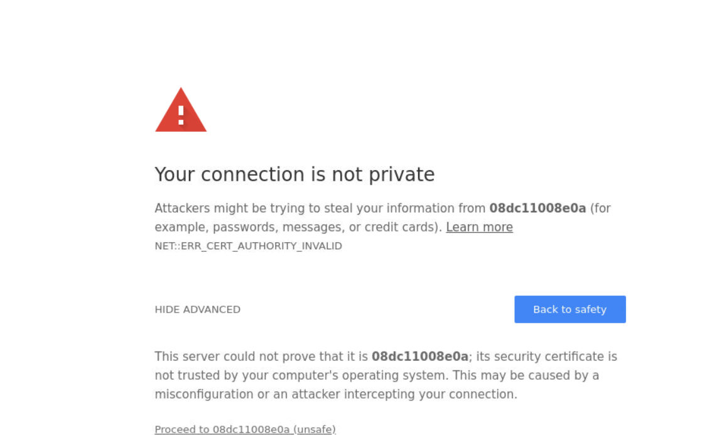
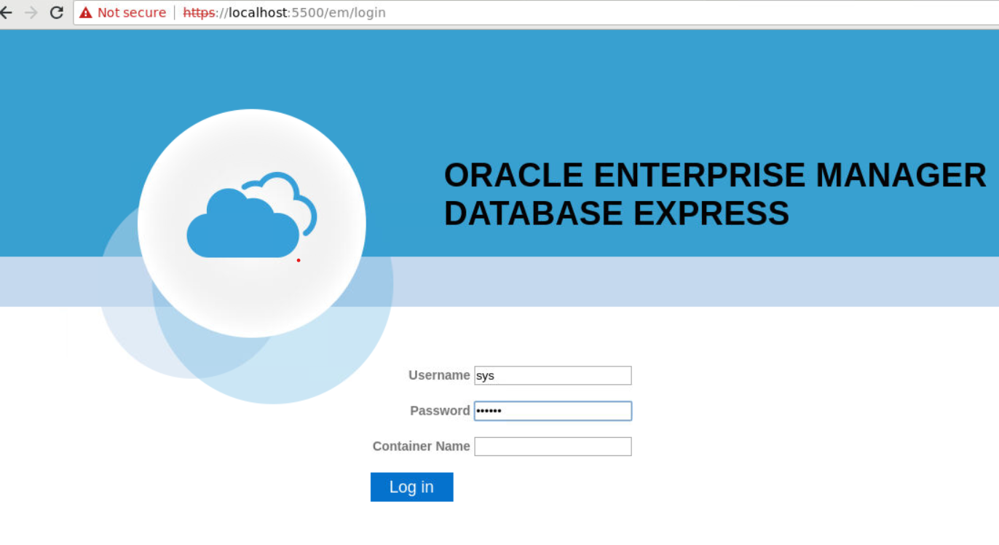
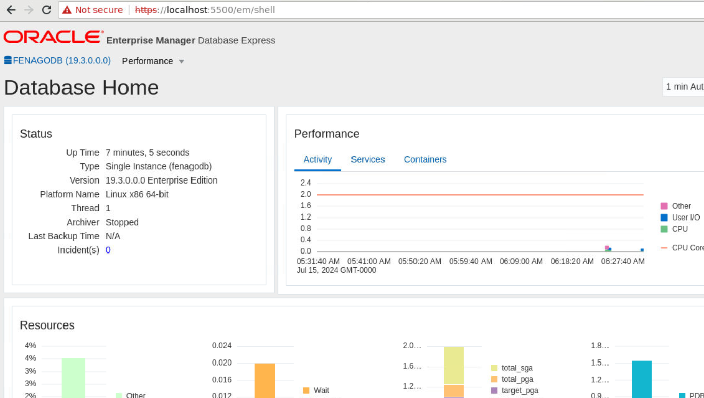

### Lab 0: Initial System and Oracle Database Version Check

#### Objective:
To verify the operating system and Oracle Database versions and understand the directory structure of the Oracle 19.3.0 DB environment.

Open terminal and run "xhost +" command as root user:



#### Steps:

1. **Check the Operating System Version**

   Open the terminal and run the following command to display the Linux version information:
   ```sh
   uname -a
   ```

   **Expected Output:**
   The output should look similar to this:
   ```
   Linux 08dc11008e0a 6.5.0-1023-azure #24~22.04.1-Ubuntu SMP Wed Jun 12 19:55:26 UTC 2024 x86_64 x86_64 x86_64 GNU/Linux
   ```

   For more detailed information, run:
   ```sh
   cat /etc/os-release
   ```

2. **Check the Oracle Database Version**

   To determine the Oracle Database version, you can run the following command:
     ```sh
   su - oracle
   ```
   then
   ```sh
   sqlplus / as sysdba
   ```
   
   Now you need to start up the database:
   ```sql
   STARTUP;
   ```

   
   
   Once in the SQL*Plus environment, run:
   ```sql
   SELECT * FROM v$version;
   ```

   **Expected Output:**
   The output should confirm that you are using Oracle Database 19.3.0.

4. **Explore the Oracle Directory Structure**

   Navigate to the Oracle installation directory and list the contents. Start by running:
   ```sh
   cd /u01/app/oracle/product/19.3.0
   ls -althr
   ```

   **Expected Output:**
   The output should list the directories and files under the Oracle installation path. Example output from your provided images:
   ```
   drwxrwxr-x 1 oracle oinstall 4.0K Jun 20 2020 ..
   drwxrwxr-x 1 oracle oinstall 4.0K Jun 20 2020 dbhome_1
   ```

5. **Create a Directory Structure Diagram**

   Based on the directory listing, draw a diagram or create a structured list of the files and directories in the Oracle 19.3.0 environment.

   **Example Directory Structure:**
   ```
   /u01/app/oracle/product/19.3.0/
   └── dbhome_1/
       ├── bin/
       ├── config/
       ├── dbs/
       ├── include/
       ├── inventory/
       ├── javavm/
       ├── jdbc/
       ├── jlib/
       ├── lib/
       ├── network/
       ├── OPatch/
       ├── oracore/
       ├── perl/
       ├── plsql/
       ├── precomp/
       ├── racg/
       ├── rdbms/
       ├── relnotes/
       ├── slax/
       ├── sqlplus/
       ├── srvm/
       ├── suptools/
       ├── uc4/
       ├── ucp/
       └── xdk/
   ```

### Summary
By completing these steps, you will be able to verify the Linux operating system version and Oracle Database version, and understand the directory structure of their Oracle 19.3.0 installation. This foundational knowledge is critical for effective database administration.

To shut down the Oracle database instance, you can use the following commands:

1. **Switch to the Oracle User (if not already switched):**
   ```sh
   su - oracle
   ```

2. **Connect to SQL*Plus as SYSDBA:**
   ```sh
   sqlplus / as sysdba
   ```

3. **Shutdown the Database:**
   Once in SQL*Plus, issue the shutdown command:
   ```sql
   SHUTDOWN IMMEDIATE;
   ```
   
   

   This command will perform a clean shutdown of the Oracle database instance. If you want to force the shutdown without waiting for current operations to complete, you can use:
   ```sql
   SHUTDOWN ABORT;
   ```

   However, `SHUTDOWN IMMEDIATE` is preferred for normal operations as it ensures a clean shutdown.

### Summary of Commands
```sh
su - oracle
sqlplus / as sysdba
SHUTDOWN IMMEDIATE;
```

### Lab 0 (Optional): Exploring the Oracle Environment

#### Objective:
To provide you with a tour of the Oracle environment, highlighting the most important directories and files, and explaining their purposes.

#### Steps:

1. **Navigate to the Oracle Home Directory**

   Switch to the Oracle user and navigate to the Oracle home directory:
   ```sh
   su - oracle
   cd /u01/app/oracle/product/19.3.0/dbhome_1
   ```

2. **Explore Important Directories and Files**

   Here are key directories and files within the Oracle home directory along with their descriptions:

   - **bin/**:
     Contains executable files for Oracle utilities and commands, such as `sqlplus`, `tnsping`, and `lsnrctl`.

   - **config/**:
     Holds configuration files for Oracle Database components.

   - **dbs/**:
     Contains database initialization parameter files (`init.ora`) and password files (`orapw<DB_NAME>`).

   - **include/**:
     Contains header files used for Oracle development, particularly for compiling OCI (Oracle Call Interface) programs.

   - **inventory/**:
     Contains the inventory of Oracle installations on the system, tracking installed products and patches.

   - **javavm/**:
     Holds files related to the Java Virtual Machine that runs within the Oracle Database.

   - **jdbc/**:
     Contains Java Database Connectivity (JDBC) libraries for Java applications to connect to Oracle Database.

   - **jlib/**:
     Contains Java library files used by various Oracle components.

   - **lib/**:
     Holds shared libraries used by Oracle Database binaries.

   - **network/**:
     Contains network configuration files, including:
     - **admin/**:
       - `listener.ora`: Configuration file for Oracle Net Listener.
       - `tnsnames.ora`: Network service names configuration file.
       - `sqlnet.ora`: Oracle Net Services configuration file.

   - **OPatch/**:
     Contains the OPatch utility used for applying patches to the Oracle software.

   - **oracore/**:
     Contains core database files and configurations.

   - **perl/**:
     Holds Perl scripts and libraries used by Oracle for various maintenance tasks.

   - **plsql/**:
     Contains PL/SQL libraries and packages.

   - **precomp/**:
     Contains files related to Oracle Precompilers, which allow embedding SQL in high-level programming languages.

   - **racg/**:
     Contains files related to Oracle Real Application Clusters (RAC) management.

   - **rdbms/**:
     Contains core database management system files and libraries.

   - **relnotes/**:
     Holds release notes and documentation for the Oracle Database version.

   - **slax/**:
     Contains SLAX (SQL Language for Oracle) related files.

   - **sqlplus/**:
     Contains files related to SQL*Plus, the command-line interface for Oracle Database.

   - **srvm/**:
     Contains server management files, particularly for RAC environments.

   - **suptools/**:
     Contains support tools provided by Oracle for diagnostics and troubleshooting.

   - **uc4/**:
     Holds files related to Oracle Universal Connection Pool (UCP).

   - **ucp/**:
     Contains Universal Connection Pool libraries.

   - **xdk/**:
     Contains XML Developer's Kit files.

#### Summary
By exploring these directories and understanding the purpose of key files, you will gain a deeper understanding of the Oracle environment. This knowledge is essential for effective database administration and troubleshooting. Navigate these directories, examine the files, and read associated documentation for a comprehensive understanding.

### Documentation Links

Here are the links to the documentation for Oracle Database 19c:

- [Oracle Database 19c Documentation](https://docs.oracle.com/en/database/oracle/oracle-database/19/index.html)
- [Oracle Database 19c Release Notes](https://docs.oracle.com/en/database/oracle/oracle-database/19/relrn/index.html)
- [Oracle Database 19c Installation Guide](https://docs.oracle.com/en/database/oracle/oracle-database/19/install-and-upgrade/index.html)
- [Oracle Database 19c Administrator's Guide](https://docs.oracle.com/en/database/oracle/oracle-database/19/admin/index.html)
- [Oracle Database 19c SQL*Plus User's Guide and Reference](https://docs.oracle.com/en/database/oracle/oracle-database/19/sqlplus/index.html)
- [Oracle Database 19c Security Guide](https://docs.oracle.com/en/database/oracle/oracle-database/19/dbseg/index.html)
- [Oracle Database 19c Backup and Recovery User's Guide](https://docs.oracle.com/en/database/oracle/oracle-database/19/bradv/index.html)

These links should provide you with comprehensive information about managing and administering Oracle Database 19c.

Yes, Oracle Database includes Oracle Enterprise Manager Database Express (EM Express), a web-based tool for managing Oracle databases. EM Express is lightweight and allows you to perform basic database administration tasks.

**Important:** Open new terminal and run these commands as **root** user:

   Make sure the `listener.ora` is created. If not, create it:
   ```sh
   cd ~/Desktop/oracle19c-administration

   cp listener.ora /u01/app/oracle/product/19.3.0/dbhome_1/network/admin/
  
   sudo chown -R oracle /u01/app/oracle/product/19.3.0/dbhome_1/network/admin/listener.ora
   ```

### Steps to Configure and Access EM Express

#### Step 1: Enable EM Express

1. **Ensure the Database Listener is Running**
   Make sure the listener is running. If not, start it:
   ```sh
   lsnrctl start
   ```

2. **Set the Port for EM Express**

   You can use the `DBMS_XDB_CONFIG.SETHTTPSPORT` procedure to set the HTTPS port for EM Express. Here, we'll set it to port `5500`:

   ```sh
   sqlplus / as sysdba
   
   SQL> STARTUP;
   SQL> EXEC DBMS_XDB_CONFIG.SETHTTPSPORT(5500);
   ```

   Verify that the port is set:
   ```sh
   SQL> SELECT DBMS_XDB_CONFIG.GETHTTPSPORT FROM DUAL;
   ```



#### Step 2: Access EM Express

1. **Open a Web Browser**

   Open your preferred web browser and enter the following URL:
   ```
   https://<hostname>:5500/em
   ```

   Replace `<hostname>` with the actual hostname or IP address of your database server. If you are running it on the same machine, you can use `localhost`.



   You can click proceed and ignore the warning.

2. **Log In to EM Express**

   You will be prompted to log in. Use the credentials for a user with DBA privileges, such as `SYS` or `SYSTEM`.

   **Example:**
   ```
   Username: SYS
   Password: fenago
   ```



   Ensure to select `AS SYSDBA` if you are logging in as the `SYS` user if option is available.

### Step 3: Managing Your Database with EM Express

Once logged in, you can perform various database management tasks, including:
- Monitoring database performance
- Managing users and security
- Configuring storage structures
- Managing database instances and services



#### Example Screens and Tasks:

1. **Home Page**
   The home page provides a summary of the database, including performance metrics and general information.

2. **Performance**
   You can monitor performance, view real-time SQL execution statistics, and check system health.

3. **Storage Management**
   Manage tablespaces, datafiles, and other storage structures.

4. **User Management**
   Create and manage database users and their privileges.

5. **Instance Configuration**
   Start and stop the database, view alert logs, and manage initialization parameters.

### Summary

Oracle Enterprise Manager Database Express (EM Express) is a convenient web-based interface for managing your Oracle database. By setting up and accessing EM Express, you can easily monitor and manage various aspects of your database, providing a comprehensive overview and control over your database environment.
