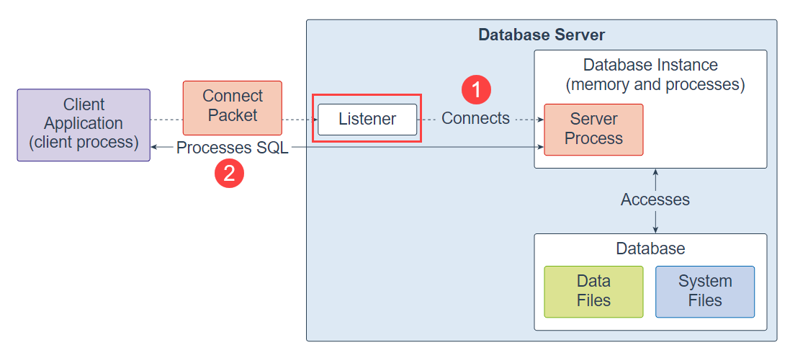
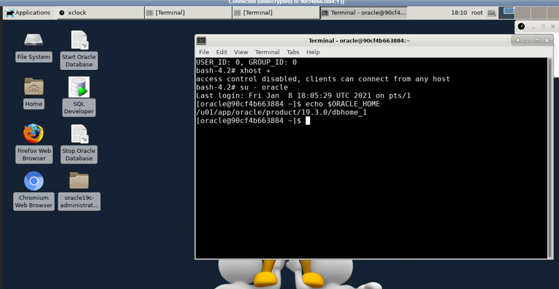
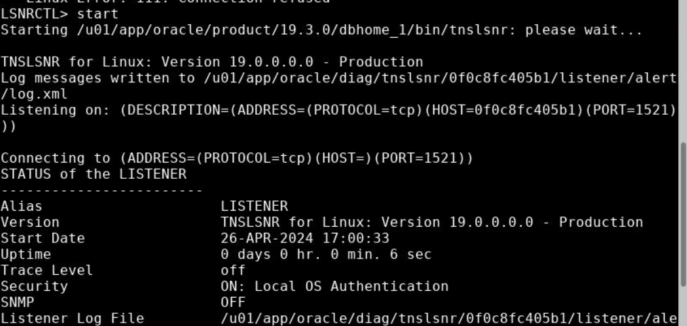

# Oracle Listener
**Summary**: In this lab, you will learn about the Oracle listener and how to use the listener control commands to manage the listener.

Introduction to the Oracle Listener
-----------------------------------

The listener is a separate database server process that runs locally on the database server or remotely on the Oracle RAC environment.

The following picture shows the Oracle Database architecture and where the listener is located:



When a client request comes, the listener first receives it. Then the listener establishes a connection between the client and the database instance.

Once the client is connected to the database instance successfully, the listener hands over the client connection to the server process.

If the listener stops running, you cannot connect to the Oracle Database anymore. However, all the existing connections will not be affected.

Switch to Oracle User
---------------------

In this step, you will switch to oracle user from terminal 

1. Open terminal and run “xhost +” command as root user:


2. Run and run "su - oracle" command in the terminal to switch to oracle user:



Oracle Listener control commands
--------------------------------

To launch the listener control, you use the LSNCTRL command from the terminal on Linux:

```
lsnrctrl
```


Type the help command to see all available options:

```
LSNRCTL> help
```


Here is the output:

```
The following operations are available
An asterisk (*) denotes a modifier or extended command:

start           stop            status          services
version         reload          save_config     trace
quit            exit            set*            show*
```

You can use all of these commands to co
ntrol the listener. Let’s use the `status` command:

```
LSNRCTL> status
```

The output shows the status of the listener.

Now, issue the stop command:

```
LSNRCTL> stop
```


Once the listener stops listening, you cannot connect to the Oracle Database anymore. Any attempt to connect to the Oracle Database will result in the following error:

```
ORA-12541: TNS:no listener
```


Note that all connections established before the listener stopped will be unaffected. Because stopping the listener prevents the incoming connections, it does not disconnect those that are already connected.

Use the start command to bring up the listener:

```
LSNRCTL> start
```



To exit the listener, you use the exit command:

```
LSNRCTL> exit
```


Another way to execute the listener command is through the command line without going into the listener control interface. For example, to view the status of the listener, you can use the following command in the Terminal on Linux:

```
lsnrctl status
```


On Windows, the Oracle listener has a service running as a TNS listener. You can also control the status of the listener via this service by stopping and starting it.

In this lab, you have learned about the Oracle Listener and how to use the commands to control the listener.
