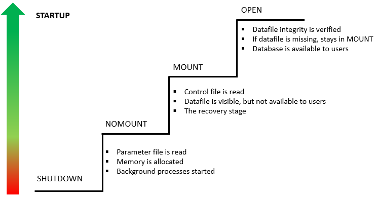

# Oracle STARTUP - How to Start an Oracle Database Instance
**Summary**: In this lab, you will learn how to use the Oracle `STARTUP` command to start an Oracle Database instance.


Connect with sqlplus CLI:

```
sqlplus / as sysdba
```

To start up a database instance, you use the `STARTUP` command:

```
STARTUP
```


When the Oracle Database starts an instance, it goes through the following stages: `NOMOUNT`, `MOUNT`, and `OPEN`.


The `STARTUP` command allows you to control the stage of the database instance.

### 1) `NOMOUNT` stage

In the `NOMOUNT` stage, Oracle carries the following steps:

*   First, search for a server parameter file in the default location. You can override the default behavior by using the `SPFILE` or `PFILE` parameters in the `STARTUP` command.
*   Next, read the parameter file to get the values of the initialization parameters.
*   Then, allocate the system global area (SGA) based on the initialization parameter settings.
*   After that, start the Oracle background processes such as `SMON`, `PMON`, and `LGWR`.
*   Finally, open the alert log and trace files and record all explicit parameters to the alert log in the valid parameter syntax.

At the `NOMOUNT` stage, Oracle does not associate the database with the instance.

### 2) `MOUNT` stage

In the `MOUNT` stage, Oracle associates a database with an instance. In other words, the instance mounts the database.

The instance carries the following steps to mount a database:

*   First, get the name of the database control files specified in the `CONTROL_FILE` initialization parameter.
*   Second, open the control files.
*   Third, find the name of the data files and the online redo log files.

When a database is mounted, the database is only available to database administrators, not all users.

### 3) `OPEN` stage

In the `OPEN` stage, Oracle performs the following actions:

*   First, open the online data files in tablespaces other than the undo tablespaces.
*   Then, select an undo tablespace. The instance uses the default undo tablespace if an undo tablespace is specified in the `UNDO_TABLESPACE` initialization parameter. Otherwise, it will select the first available undo tablespace.
*   Finally, open the online redo log files.

When Oracle opens a mounted database, the database is available for normal operations.

The following picture illustrates the Oracle database startup process:



Oracle `STARTUP` command
------------------------

**Note:** Run `SHUTDOWN` command before running each command below first. Otherwise, you will get cannot start already running Oracle error.

The basic syntax of the `STARTUP` command is as follows:

```
STARTUP;
```


It is equivalent to starting the database instance in the `OPEN` stage:

```
STARTUP OPEN;

```

To start up a database instance in the `NOMOUNT` stage, you use the following command:

```
STARTUP NOMOUNT;

```


To bring the database to the next stage, you use the `ALTER DATABASE` statement. For example, this statement brings the database from the `NOMOUNT` to the `MOUNT` stage:

```
ALTER DATABASE MOUNT;

```


Oracle STARTUP command example
------------------------------

First, launch the SQL\*Plus program and log in to the Oracle Database as the `SYS` user.

Second, issue the `SHUTDOWN IMMEDIATE` command to shut down the database:

```
shutdown immediate;
```


Here is the output:

```
Database dismounted.
ORACLE instance shut down.
```


Third, start the database instance at the `OPEN` stage:

```
startup
```


Here is the output:


Fourth, shut down the instance again:

```
shutdown immediate;
```


Fifth, start the database instance at the `MOUNT` state:

```
startup mount;
```


The output is:

```
ORACLE instance started.

Total System Global Area 2550136832 bytes
Fixed Size                  3835304 bytes
Variable Size             738200152 bytes
Database Buffers         1795162112 bytes
Redo Buffers               12939264 bytes

```


Sixth, check the current status of the database instance by querying the `v$instance` view:

```
SELECT 
    instance_name, 
    status 
FROM 
    v$instance;
```


Output:

```
INSTANCE_NAME    STATUS

fenagodb             MOUNTED

```


Seventh, bring the database to the `OPEN` stage by using the `ALTER DATABASE` command:

```
ALTER DATABASE OPEN;
```


Output:

```
Database altered.
```


Finally, check the status of the database by executing the following statement:

```
SELECT 
    instance_name, 
    status 
FROM 
    v$instance;
```


Now, the database is open and available for normal operations.

```
INSTANCE_NAME    STATUS

fenagodb             OPEN

```


In this lab, you have learned how to start a database instance using the Oracle `STARTUP` command.
