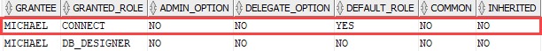

# Oracle ALTER ROLE Statement

**Summary**: In this lab, you will learn how to use the Oracle `ALTER ROLE` statement to modify the authorization needed to enable a role.

Introduction to Oracle ALTER ROLE statement
-------------------------------------------

The `ALTER ROLE` statement allows you to modify the authorization needed to enable a role.

Here is the basic syntax of the `ALTER ROLE` statement:

```
ALTER ROLE role_name 
    { NOT IDENTIFIED | IDENTIFIED BY password }

```


In this syntax:

*   First, specify the name of the role that you want to change.
*   Second, use the corresponding action such as `NOT IDENTIFIED` to not use a password, or `IDENTIFIED BY password` to change the password of the role.

To execute the `ALTER ROLE` statement, your account must either have been granted the role with `ADMIN OPTION` or have the `ALTER ANY ROLE` system privilege.

Note that it is not possible to change a `NOT IDENTIFIED` role to a `IDENTIFIED BY password` role if the role has been granted to another role.

Oracle ALTER ROLE statement example
-----------------------------------

Let’s take an example of using the `ALTER ROLE` statement to change an `IDENTIFIED BY password` role to a `NOT IDENTIFIED` role.

First, [create a new role] called `db_designer`:

```
CREATE ROLE db_designer IDENTIFIED BY abcd1234;

```


Second, grant the `CREATE TABLE` and `CREATE VIEW` system privileges to the `db_designer` role:

```
GRANT CREATE TABLE, CREATE VIEW TO db_designer;
```


Third, create a user called `michael`:

```
CREATE USER michael IDENTIFIED BY xyz123;
```


Fourth, grant the `db_designer` and `connect` roles to the user `michael`:

```
GRANT db_designer, connect TO michael;
```


The following query returns the roles granted to the user `michael`:

```
SELECT * 
FROM dba_role_privs 
WHERE grantee = 'MICHAEL';
```




Fifth, log in to the Oracle Database using the user `michael` and [set the role] of `michael` to `db_designer`:

```
SET ROLE db_designer 
IDENTIFIED BY abcd1234;
```


Sixth, go back to the first session and change the role to a `NOT IDENTIFIED` role:

```
ALTER ROLE db_designer NOT IDENTIFIED;

```


Seventh, go to the user michael’s session, and reissue the `[SET ROLE]` statement again. This time we don’t need a password since the role has been changed:

```
SET ROLE db_designer;
```


In this lab, you have learned how to use the Oracle `ALTER ROLE` statement to change the authorization needed to enable a role.
