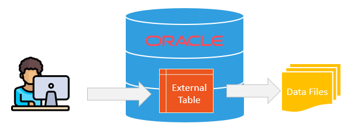
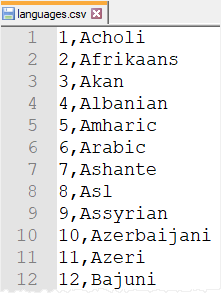
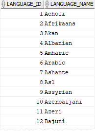

# An Essential Guide to Oracle External Tables By Practical Examples
**Summary**: In this lab, you will learn about Oracle external tables that allow you to access data in flat files as if it were in tables.

What is an Oracle external table
--------------------------------

An external table is a table whose data come from flat files stored outside of the database.

Oracle can parse any file format supported by the SQL\*Loader.

Why do you need to use external tables
--------------------------------------

The external tables can be useful in the ETL process of data warehouses because the data does not need to be staged and can be queried in parallel.

Notice that you should not use external tables for frequently accessed tables.

Creating an Oracle external table steps
---------------------------------------

You follow these steps to create an external table:

*   First, create a directory which contains the file to be accessed by Oracle using the `CREATE DIRECTORY` statement.
*   Second, grant `READ` and `WRITE` access to users who access the external table using the `GRANT` statement.
*   Third, create the external table by using the `CREATE TABLE ORGANIZATION EXTERNAL` statement.



Creating an Oracle external table example
-----------------------------------------

Here is a CSV file that has two columns: language id and name.



[Download the languages.csv file](./images/languages.csv)

We will create an external table that maps to the `languages.csv` file.

### 1) Create a directory object

First, place the `language.csv` file in the `C:\loader` directory.

Second, log in to the Oracle database using the `sysdba` user via the SQL\*Plus program:

```
Enter user-name: sys@fenagodb1 as sysdba   
Enter password: <sysdba_password>
```


Third, create a new directory object called `lang_external` that maps to the `C:\loader` directory:

```
SQL> create directory lang_external as 'C:\loader';   
<pre class="lang:plsql decode:true "></pre>
```


### 2) Grant `READ` and `WRITE` access on the directory object to users:

The following statement grant `READ` and `WRITE` privileges to the `OT` user:

```
SQL> grant read,write on directory lang_external to ot;
Grant succeeded.
```


### 3) Creating the external table

Use the `CREATE TABLE ORGANIZATION EXTERNAL` statement to create the external table called `languages`:

```
CREATE TABLE languages(
    language_id INT,
    language_name VARCHAR2(30)
)
ORGANIZATION EXTERNAL(
    TYPE oracle_loader
    DEFAULT DIRECTORY lang_external
    ACCESS PARAMETERS 
    (FIELDS TERMINATED BY ',')
    LOCATION ('languages.csv')
);

```


When you create the external table using the `CREATE TABLE ORGANIZATION EXTERNAL` statement, you need to specify the following attributes:

### `TYPE`

The `TYPE` determines the type of the external table. Oracle provides two types: `ORACLE_LOADER` and `ORACLE_DATADUMP`:

*   The `ORACLE_LOADER` access driver is the default that loads data from text data files. Technically speaking, the `ORACLE_LOADER` loads data from an external table to an internal table. However, it cannot unload the data i.e., it cannot move data from the internal table to the external table.
*   The `ORACLE_DATAPUMP` access driver can perform both loads and unloads. It requires the data in the binary dump file format.

### `DEFAULT DIRECTORY`

The `DEFAULT DIRECTORY` clause allows you to specify the default directory for storing all input and output files. It accepts a directory object, not a directory path.

### `ACCESS PARAMETERS`

The `ACCESS PARAMETERS` clause allows you to describe the external data source. Note that each access driver has its own access parameters.

### `LOCATION`

The `LOCATION` clause specifies the data files for the external table.

You specify the data file in the form `directory:file`. If you omit the `directory` part, Oracle uses the `DEFAULT DIRECTORY` for the file.

Using an Oracle external table
------------------------------

Once the external table is created, you can [query] it like a normal table:

```
SELECT 
    language_id, 
    language_name 
FROM 
    languages
ORDER BY 
    language_name;

```


Here is the partial output:



You can also [create a view] based on the external table:

```
CREATE VIEW language_a 
AS
SELECT language_name 
FROM languages
WHERE language_name LIKE 'A%';

```


However, you cannot apply the `INSERT`, `DELETE`, and `UPDATE` to the external table:

```
DELETE FROM languages 
WHERE language_id = 1;
```


Here is the error message:

```
SQL Error: ORA-30657: operation not supported on external organized table
```


The same error will occur if you attempt to insert a new row into the external table:

```
INSERT INTO languages(language_id, language_name) 
VALUES(190,'Alien');
```


Oracle external table troubleshooting
-------------------------------------

If you forget to grant the directory permission to users who access the external table, you will receive the following error:

```
ORA-29913: error in executing ODCIEXTTABLEFETCH callout
ORA-30653: reject limit reached
```


Oracle will issue the following error if you attempt to define a constraint such as `primary key` and `foreign key` constraints on the external table.

```
ORA-30657: operation not supported on external organized table
```


In this lab, you have learned about Oracle external tables and how to use them to access data from flat files as they were in normal tables.
