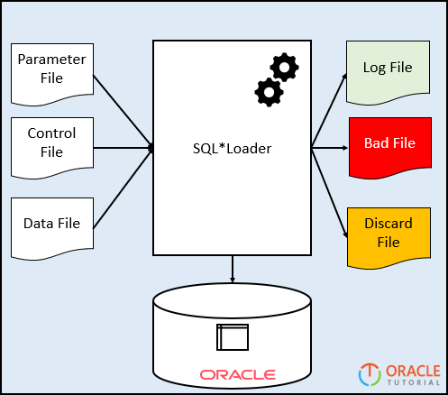
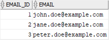

# SQL*Loader - Load a Datafile Into a Table

**Summary**: In this lab, you will learn how to use the Oracle SQL\*Loader tool to load from a flat-file into a table in the database.

SQL\*Loader tool
--------------------------------

SQL\*Loader allows you to load data from an external file into a table in the database. It can parse many delimited file formats such as CSV, tab-delimited, and pipe-delimited.

SQL\*Loader provides the following methods to load data:

*   Conventional path loads – construct `[INSERT]` statements from the contents of the input datafile based on the predefined specification and execute the inserts.
*   Direct path loads – creates data blocks in Oracle database block format from the datafile and directly writes the data block to the database. This way is much faster than the conventional path but subject to some restrictions.
*   External table loads – create an [external table] for the data stored in the datafile and execute `INSERT` statements to insert the data from the datafile into the target table. The external table loads support parallel loading if datafile is big enough.

To execute the SQL\*Load tool, you need at least three files:

*   The input data file stores delimited or raw data
*   The parameter file stores the location of the input/output files
*   The control file contains the specification on how data is loaded.

After that, you execute the command `sqlldr` from the Terminal on GNU/Linux:

```
>sqlldr parfile=parameter_file.par

```


The following picture illustrates the SQL\*Loader process:



Let’s take the example of using the SQL\*Load tool.

SQL\*Loader example
-------------------

We will load email data in CSV file format into the `emails` table in the database.

### Prepare the input files

The following is the content of the `email.dat` file:

```
1,john.doe@example.com
2,jane.doe@example.com
3,peter.doe@example.com
```


The contents of the control file (`email.ctl`) is as follows:

```
load data into table emails
insert 
fields terminated by ","
(
    email_id,
    email
)
```


In the control file:

*   The `load data into table emails insert` instruct the SQL\*Loader to load data into the emails table using the INSERT statement.
*   The `fields terminated by "," (email_id,email)` specifies that each row in the file has two columns `email_id` and `email` separated by a comma (,).

Here is the content of the parameter file (`email.par`):

```
USERID=system/fenago
CONTROL=email.ctl
LOG=email.log
BAD=email.bad
DATA=email.dat
DIRECT=true
```


In this parameter file, we specify the user (`userid`) that will connect to the Oracle database, the control file (`email.ctl`), log file (`email.log`), and data file (`email.dat`).

The `email.bad` file stores invalid data. The last line `direct=true` instructs the SQL\*Loader to use the direct path load method.

Note that there is no space between the parameter and value, for example:

```
control=email.ctrl
```


After having three files, you can place them in a directory e.g., `/home/oracle/sqlloader`.


```
cd ~/Desktop/oracle19c-administration/lab25

mkdir -p /home/oracle/sqlloader

cp -r * /home/oracle/sqlloader

chown -R oracle /home/oracle/sqlloader
```

### Load data from a flat file into the table

Connect with SQL Plus:


```
su - oracle

sqlplus / as sysdba
```

First, create a new table to store the email data from the input datafile:


```
conn system/fenago

CREATE TABLE emails(
    email_id NUMBER PRIMARY KEY,
    email VARCHAR2(150) NOT NULL
);
```


Second, launch the SQL\*Loader program from the directory in which you store the files using the `sqlldr` command:

```
su - oracle

cd /home/oracle/sqlloader

sqlldr parfile=email.par
```


Here is the output:

```
Path used:      Direct

Load completed - logical record count 3.

Table EMAILS:
3 Rows successfully loaded.

Check the log file:
email.log
for more information about the load.
```


Third, log in to the Oracle as **system** user and verify the contents of the `emails` table:

```
SELECT * FROM emails;
```


Here is the result set:



Finally, review the log file:

```
SQL*Loader: Release 19.3.0.0.0 - Production on Tue Jul 23 08:04:46 2023

Copyright (c) 1982, 2014, Oracle and/or its affiliates.  All rights reserved.

Control File:   email.ctl
Data File:      email.dat
  Bad File:     email.bad
  Discard File:  none specified
 
 (Allow all discards)

Number to load: ALL
Number to skip: 0
Errors allowed: 50
Continuation:    none specified
Path used:      Direct

Table EMAILS, loaded from every logical record.
Insert option in effect for this table: INSERT

   Column Name                  Position   Len  Term Encl Datatype
------------------------------ ---------- ----- ---- ---- ---------------------
EMAIL_ID                            FIRST     *   ,       CHARACTER            
EMAIL                                NEXT     *   ,       CHARACTER            

The following index(es) on table EMAILS were processed:
index SYS_C0010446 loaded successfully with 3 keys

Table EMAILS:
  3 Rows successfully loaded.
  0 Rows not loaded due to data errors.
  0 Rows not loaded because all WHEN clauses were failed.
  0 Rows not loaded because all fields were null.

Bind array size not used in direct path.
Column array  rows :    5000
Stream buffer bytes:  256000
Read   buffer bytes: 1048576

Total logical records skipped:          0
Total logical records read:             3
Total logical records rejected:         0
Total logical records discarded:        0
Total stream buffers loaded by SQL*Loader main thread:        2
Total stream buffers loaded by SQL*Loader load thread:        0

Run began on Tue Jul 23 08:04:46 2019
Run ended on Tue Jul 23 08:04:48 2019

Elapsed time was:     00:00:01.47
CPU time was:         00:00:00.07
```


In this lab, you have learned how to use the SQL\*Loader to load data from a flat file into a table in the database.
