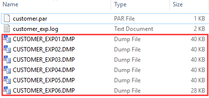
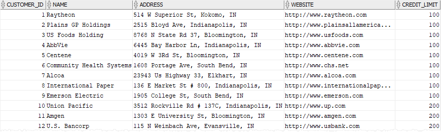

# Oracle Data Pump Import (impdp)

**Summary**: In this lab, you will learn how to use the Oracle Data Pump Import to load an export dump file set into a target Oracle Database system.

Oracle Data Pump Import tool
-----------------------------

The Data Pump Import program is a tool that allows you to load an export **dump file set** into a target Oracle database system. The Data Pump Import utility comes with the Oracle Installation by default.

The dump file set consists of one or more disk files that store table data, database object metadata, and control information. The dump file set is created by running the [Data Pump Export] tool.

Note that the Data Pump Import is a replacement of the legacy Import tool called `imp` starting from Oracle 10g. Oracle recommends the Data Pump Import tool because it is more flexible and can be 15 times faster than the legacy tool in terms of performance.

How to run the Data Pump Import tool
------------------------------------

To invoke the Data Pump Import tool, you use the following command:

```
su - oracle

impdp
```


The behavior of the tool depends on the import parameters that you specify, either on the command line or in a parameter file.

Oracle Data Pump Import tool example
------------------------------------

We will load the dump file set exported in the `Data Pump Export lab` for the demonstration.



First, create a parameter file named `customer_imp.par` with the following contents and place it in the `/home/oracle/export` folder:

```
userid=system/fenago
directory=system_external
dumpfile=customer_exp%U.dmp
logfile=customer_imp.log
remap_table=system.customers:customers_bk
```


In this parameter file, the `remap_table` option renames the `customers` table to `customers_bk` table.

Then, use the `impdp` command to invoke the Data Pump Import tool with the parameter file `customer_imp.par`:

```
impdp parfile=customer_imp.par
```


Finally, verify the contents of the `customers_bk` table:

```
SELECT * FROM customers;
```


Here is the partial output:



In this lab, you have learned how to use the Oracle Data Pump Import tool to load an export dump file set into an Oracle Database system.
