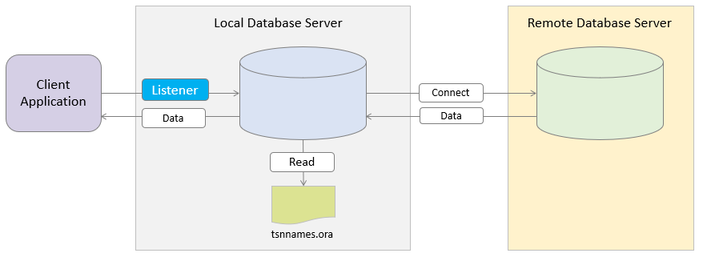
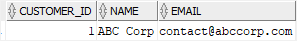
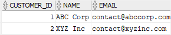

# Learn Oracle CREATE DATBASE LINK Statement

**Summary**: In this lab, you will learn about the Oracle database link and how to create a database link to a remote Oracle Database server.

What is an Oracle database link
-------------------------------

A database link is a connection from the Oracle database to another remote database. The remote database can be an Oracle Database or any ODBC-compliant database such as SQL Server or MySQL.



Why do you need a database link
-------------------------------

A database link allows a user or program to access database objects such as tables and views from another database.

Once you create a database link, you can access the tables or views from the remote database using the following pattern:

```
table_name@database_link
```


For example, you can query data from a table in the remote database as if it were in the local server:

```
SELECT * FROM remote_table@database_link;
```


When accessing a remote table or view over the database link, the Oracle database acts as an Oracle client.

Using a synonym to simplify the syntax for accessing objects via a database link
--------------------------------------------------------------------------------

To simplify the syntax, you can [create a synonym] for the remote object accessed via the database link and use this object as if it were a local object.

This syntax shows how to create a synonym for a remote table:

```
CREATE SYNONYM local_table
FOR remote_table@database_link;
```


This query uses the synonym instead of the remote table name with the database link:

```
SELECT * FROM local_table;
```


Oracle CREATE DATABASE LINK statement
-------------------------------------

There are two types of database links: public and private.

Private database links are visible to the owners while public database links are visible to all users in the database. For this reason,  public database links may pose some potential security risks.

To create a private database link, you use the `CREATE DATABASE LINK` statement as follows:

```
CREATE DATABASE LINK dblink
CONNECT TO remote_user IDENTIFIED BY password
USING 'remote_database';
```


In this syntax:

*   First, specify the name of the database link after the `CREATE DATABASE LINK` keywords.
*   Second, provide the user and password of the remote database after the `CONNECT TO` and `IDENTIFIED BY` keywords.
*   Finally, specify the service name of the remote database. If you specify only the database name, Oracle will append the database domain to the connect string to form a complete service name.

Typically, you add an entry in the `tnsnames.ora` file and reference it as the `remote_database` in the `USING` clause.

The following statement shows how to create the private database link to a user in a remote database with a full connection string.

```
CREATE DATABASE LINK dblink 
    CONNECT TO remote_user IDENTIFIED BY password
    USING '(DESCRIPTION=
                (ADDRESS=(PROTOCOL=TCP)(HOST=oracledb.example.com)(PORT=1521))
                (CONNECT_DATA=(SERVICE_NAME=service_name))
            )';

```


To create a public database link, just add the `PUBLIC` keyword:

```
CREATE PUBLIC DATABASE LINK dblink 
    CONNECT TO remote_user IDENTIFIED BY password
    USING 'remote_database';

```


Create a database link example
------------------------------

In this example, we will create a database link to a remote Oracle Database server located on the server `10.50.100.143` with the port `1521` and service name `SALES`.

First, add the following entry to `tnsnames.ora` file in the local Oracle Database server. Typically, the `tnsnames.ora` is located in the directory `/NETWORK/ADMIN/` under `ORACLE_HOME`:

```
SALES =
(DESCRIPTION =
    (ADDRESS = (PROTOCOL = TCP)(HOST = 10.50.100.143)(PORT = 1521))
    (CONNECT_DATA =
    (SERVER = DEDICATED)
    (SERVICE_NAME = SALES_PRD)
    )
)
```


Next, use the `CREATE DATABASE LINK` statement to create a new private database link that connects to the `SALES` database via `bob`‘s account:

```
CREATE DATABASE LINK sales 
    CONNECT TO bob IDENTIFIED BY Abcd1234
    USING 'SALES';
```


Then, issue the `[SELECT]` statement to query data from the `customers` table on the `SALES` database:

```
SELECT * FROM customers@sales;
```


Here is the output:



After that, [insert a new row] into the `customers` table:

```
INSERT INTO customers@sales(customer_id, name, email)
VALUES(2,'XYZ Inc','[email protected]');
```


Finally, query data from the `customers` table again:

```
SELECT * FROM customers@sales
```


The result set is as follows:



Oracle Database Link best practices
-----------------------------------

Here are some best practices using the database links:

1.  Naming convention: the name of the database links should reflect the nature of the data, not the database server. For example, instead of naming a database link `SALES_PRD`, you name it as `SALES`.
2.  Remote database users: you should create a user dedicated to a database link. In addition, you should not give this user to anyone else. If you don’t follow this, the database will not work when someone changes the password of the user or even delete it.
3.  Use a service-specific entry in the `tnsnames.ora` instead of the database-specific alias so that you copy between product, test, and development environments, you don’t have to recreate the database link.

In this lab, you have learned about the Oracle database link concept and how to use the Oracle `CREATE DATABASE LINK` to create a new database link to a remote Oracle Database server.
