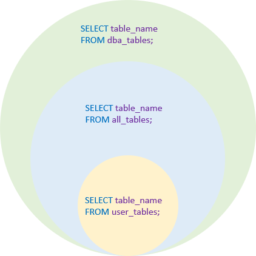

# Oracle Show Tables: List Tables in Oracle Database
**Summary**: In this lab, you will learn step by step how to show tables in the Oracle Database by querying from the data dictionary views.

If you have worked with MySQL, you may be familiar with the `[SHOW TABLES](http://www.mysqltutorial.org/mysql-show-tables/)` command that lists all tables in a database:

```
SHOW TABLES;
```


Unfortunately, Oracle **does not** directly support the `SHOW TABLES` command. However, you can list all tables in a database by querying from various data dictionary views.

Show tables owned by the current user
-------------------------------------

To show tables **owned** by the current user, you query from the `user_tables` view.

```
SELECT table_name
FROM user_tables
ORDER BY table_name;

```


Note that this view does not show the `OWNER` column. Also, the `user_tables` table does not contain the other tables that are **accessible** by the current user.

Show tables that are accessible by the current user
---------------------------------------------------

To show all tables that are currently **accessible** by the current user, regardless of owners, you query from the `all_tables` view:

```
SELECT table_name
FROM all_tables
ORDER BY table_name;
```


If you want to show all tables of a specific owner, you add the `OWNER` column in the `[WHERE]` clause as shown in the following query:

```
SELECT *
FROM all_tables
WHERE OWNER = 'OT'
ORDER BY table_name;
```


Show all tables in the Oracle Database
--------------------------------------

To show **all tables** in the entire Oracle Database, you query from the `dba_tables` view as follows:

```
SELECT table_name 
FROM dba_tables;
```


You will get the following error message if you don’t have access to the `dba_tables` view:

```
ORA-00942: table or view does not exist

```


In this case, you should request your database administrator to grant your account privileges on the `dba_tables` view, or `SELECT ANY DICTIONARY` privilege, or `SELECT_CATALOG_ROLE` privilege.

The following picture illustrates the tables that can be returned from the `user_tables`, `all_tables`, and `dba_tables` views:



In this lab, you have learned how to show tables in the Oracle Database by querying from the data dictionary views including `user_tables`, `all_tables`, and `dba_tables`.
