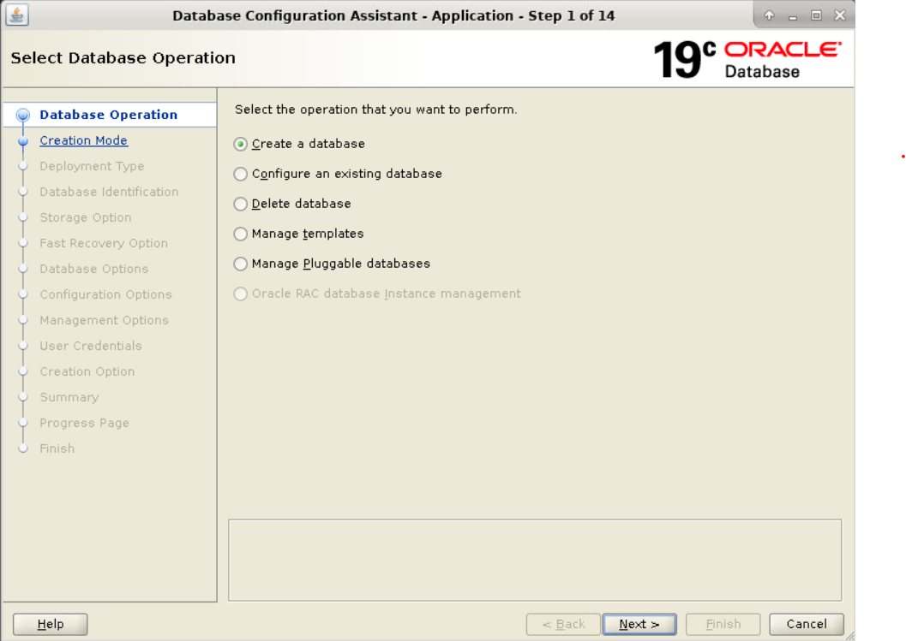
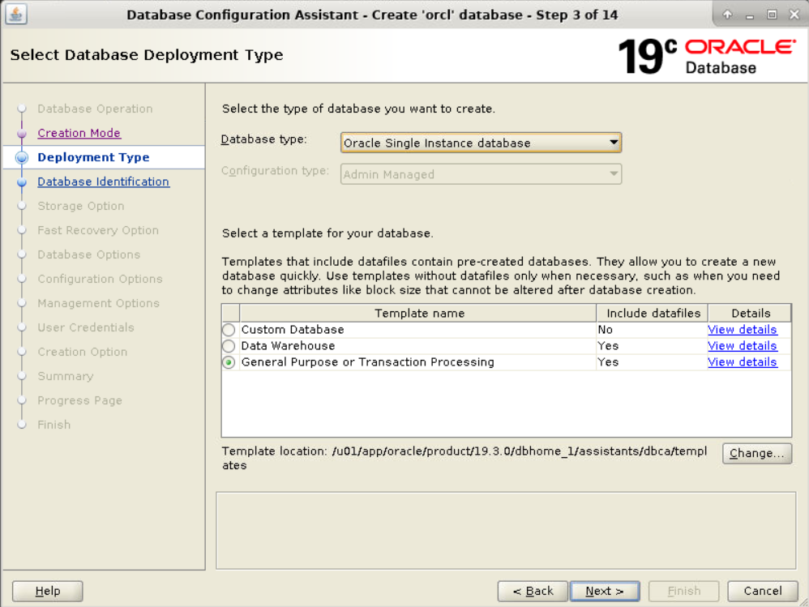
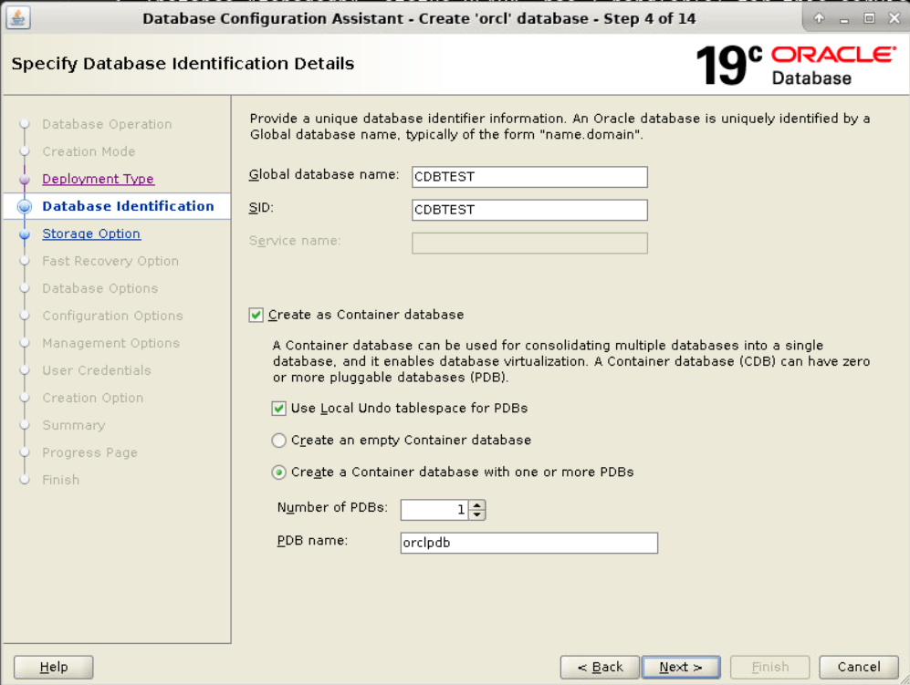
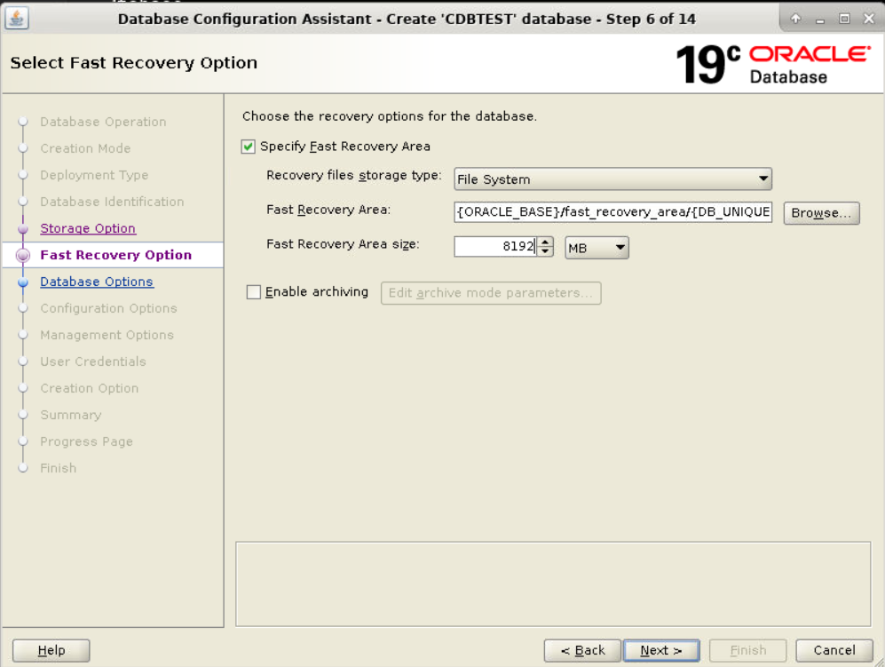
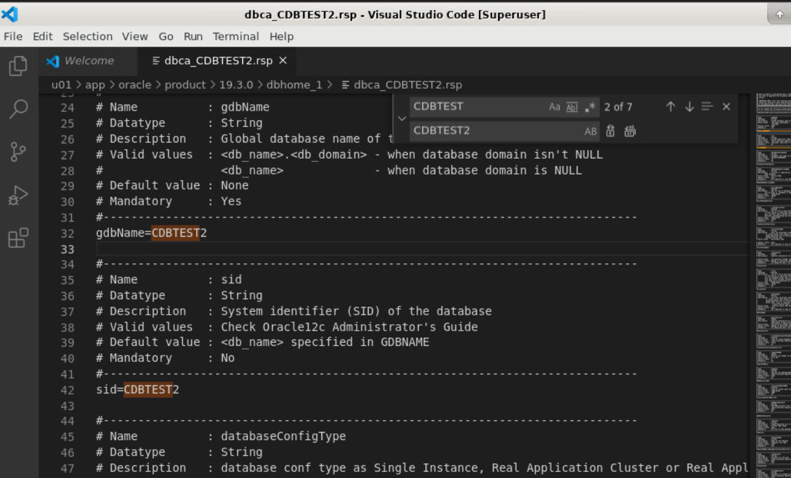

### Lab 3.1: Creating a New CDB Using DBCA GUI and Response File

**Objective:**
To create a new Container Database (CDB) named `CDBTEST` using the DBCA GUI, save the response file, and use it to create a second CDB in silent mode. The steps will include starting and stopping both CDBs.

**Steps:**

#### Part A: Create the First CDB Using DBCA GUI

1. **Set Up Environment Variables**

   Open a terminal and set the Oracle environment variables:

   ```sh
   export ORACLE_SID=CDBTEST
   export ORACLE_HOME=/u01/app/oracle/product/19.3.0/dbhome_1
   export PATH=$ORACLE_HOME/bin:$PATH
   ```

   Make sure the `listener.ora` is created. If not, create it:
   ```sh
   cd ~/Desktop/oracle19c-administration

   cp listener.ora /u01/app/oracle/product/19.3.0/dbhome_1/network/admin/
  
   sudo chown -R oracle /u01/app/oracle/product/19.3.0/dbhome_1/network/admin/listener.ora
   ```

   then
   ```
   lsnrctl status
   lsnrctl start
   ```

3. **Launch DBCA GUI**

   Start the Database Configuration Assistant (DBCA) with the GUI:

   ```sh
   dbca
   ```

4. **Create a New Database**

   Follow these steps in the DBCA GUI:

   - **Welcome Screen**: Click `Next`.
   
   - **Database Operation**: Select `Create a database` and click `Next`.
   - **Creation Mode**: Select `Advanced configuration` and click `Next`.
   - **Database Template**: Choose `General Purpose or Transaction Processing` and click `Next`.
   
   - **Database Identification**: Enter `Global Database Name: CDBTEST` and `SID: CDBTEST`. Click `Next`.
   
   - **Management Options**: Enable `Configure Enterprise Manager (EM) Express` and set the port to `5502`. Click `Next`.
   - **Storage Option**: Select `File System` and click `Next`.
   - **Database File Locations**: Set the database file location to `/u01/app/oracle/oradata/CDBTEST`. Click `Next`.
   - **Fast Recovery Area**: Enable it and set the location to `/u01/app/oracle/fast_recovery_area` with size `16384 MB`. Click `Next`.
   
   - **Network Configuration**: Ensure listener is configured. Click `Next`.
   - **Data Vault Option**: Skip this step by clicking `Next`.
   - **Initialization Parameters**: Set memory to `2048 MB`, `Processes` to `300`, and ensure `Character Set` is `AL32UTF8`. Click `Next`.
   - **Storage Locations**: Verify the storage settings and click `Next`.
   - **Creation Options**: Select `Create Database` and check `Generate Database Creation Scripts`. Click `Next`.

5. **Save the Response File**

   In the summary screen, save the response file for future use:

   - Click on `Save Response File`.
   - Save it as `/u01/app/oracle/product/19.3.0/dbhome_1/dbca_CDBTEST.rsp`.

6. **Create the Database**

   Click `Finish` to create the database.

7. **Verify the Database Creation**

   After the database is created, connect to it and verify:

   ```sh
   sqlplus / as sysdba
   SQL> SELECT name, open_mode FROM v$database;
   ```

   Expected Output:

   ```sh
   NAME    OPEN_MODE
   ------- ----------
   CDBTEST READ WRITE
   ```

8. **Check EM Express Port**

   Verify EM Express configuration:

   ```sh
   SELECT dbms_xdb_config.getHttpsPort() FROM dual;
   ```

   Expected Output:

   ```sh
   GETHTTPSPORT
   ------------
   5502
   ```

9. **Stop the Database**

   ```sh
   sqlplus / as sysdba
   SQL> SHUTDOWN IMMEDIATE;
   ```

#### Part B: Create the Second CDB Using the Response File

1. **Edit the Response File**

   Edit the saved response file to create a new CDB named `CDBTEST2`:

   ```sh
   cp /u01/app/oracle/product/19.3.0/dbhome_1/dbca_CDBTEST.rsp /u01/app/oracle/product/19.3.0/dbhome_1/dbca_CDBTEST2.rsp
   nano /u01/app/oracle/product/19.3.0/dbhome_1/dbca_CDBTEST2.rsp
   ```

   Change the following parameters and in all other locations replace "CDBTEST" with "CDBTEST2" using nano or vscode editor:

   ```ini
   GDBNAME = "CDBTEST2"
   SID = "CDBTEST2"
   ```
   
   
2. **Run DBCA in Silent Mode**

   Run DBCA in silent mode using the edited response file:

   ```sh
   dbca -silent -createDatabase -responseFile /u01/app/oracle/product/19.3.0/dbhome_1/dbca_CDBTEST2.rsp
   ```

3. **Verify the Second Database Creation**

   After the database is created, connect to it and verify:

   ```sh
   export ORACLE_SID=CDBTEST2
   sqlplus / as sysdba
   SQL> SELECT name, open_mode FROM v$database;
   ```

   Expected Output:

   ```sh
   NAME      OPEN_MODE
   --------- ----------
   CDBTEST2  READ WRITE
   ```

4. **Check EM Express Port for the Second CDB**

   Verify EM Express configuration for `CDBTEST2`:

   ```sh
   SELECT dbms_xdb_config.getHttpsPort() FROM dual;
   ```

   Expected Output:

   ```sh
   GETHTTPSPORT
   ------------
   5502
   ```

5. **Stop the Second Database**

   ```sh
   sqlplus / as sysdba
   SQL> SHUTDOWN IMMEDIATE;
   ```

6. **Start the First Database**

   ```sh
   export ORACLE_SID=CDBTEST
   sqlplus / as sysdba
   SQL> STARTUP;
   ```

### Summary

In this lab, you created a new CDB named `CDBTEST` using the DBCA GUI, saved the response file, and used it to create a second CDB named `CDBTEST2` in silent mode. You verified the creation of both databases, checked the EM Express configuration, and managed the database instances. This practice helps you understand both GUI-based and silent mode database creation and management in Oracle.

### Lab 3.1 Part 2: Verifying the CDB and System Details

**Objective:**
To verify and provide details on the CDB and the system using read-only commands from the command line and SQL*Plus. This will ensure that the database and system configurations are correct and provide insight into the system's health and configuration.

**Steps:**

#### 1. Set Up Environment Variables

Open a terminal and set the Oracle environment variables:

```sh
export ORACLE_SID=CDBTEST
export ORACLE_HOME=/u01/app/oracle/product/19.3.0/dbhome_1
export PATH=$ORACLE_HOME/bin:$PATH
```

#### 2. Verify the Linux System Details

**a. Check the Linux Distribution and Version:**

```sh
cat /etc/os-release
```

*Explanation:*
This command displays the Linux distribution and version. It's important to verify that the OS meets the Oracle database's requirements.

**Expected Output:**

```sh
NAME="Oracle Linux Server"
VERSION="7.9"
ID="ol"
ID_LIKE="fedora"
VERSION_ID="7.9"
...
```

**b. Check the Kernel Version:**

```sh
uname -r
```

*Explanation:*
This command shows the kernel version, which is important for ensuring compatibility with Oracle software.

**Expected Output:**

```sh
4.14.35-1818.3.3.el7uek.x86_64
```

**c. Check System Uptime:**

```sh
uptime
```

*Explanation:*
This command shows how long the system has been running, which can be useful for understanding the system's stability.

**Expected Output:**

```sh
 14:22:16 up 10 days,  3:45,  2 users,  load average: 0.15, 0.10, 0.09
```

#### 3. Verify Database and Instance Details Using SQL*Plus

**a. Connect to the Database:**

```sh
sqlplus / as sysdba
```

**b. Check the Database Name and Open Mode:**

```sh
SELECT name, open_mode FROM v$database;
```

*Explanation:*
This query confirms that the database is correctly named and is open for read/write operations.

**Expected Output:**

```sh
NAME      OPEN_MODE
--------- ----------
CDBTEST   READ WRITE
```

**c. Verify the Instance Name and Status:**

```sh
SELECT instance_name, status FROM v$instance;
```

*Explanation:*
This query shows the name and status of the instance, which should be running.

**Expected Output:**

```sh
INSTANCE_NAME   STATUS
--------------  ------------
CDBTEST         OPEN
```

**d. List All PDBs and Their Status:**

```sh
SELECT con_id, name, open_mode FROM v$pdbs;
```

*Explanation:*
This query lists all pluggable databases (PDBs) and their status, verifying that they are properly created and accessible.

**Expected Output:**

```sh
CON_ID  NAME       OPEN_MODE
------  ---------- ----------
2       PDB$SEED   READ ONLY
3       PDB1       READ WRITE
4       PDB2       READ WRITE
5       PDB3       READ WRITE
```

**e. Check the Memory Usage:**

```sh
SELECT component, current_size FROM v$sga_dynamic_components;
```

*Explanation:*
This query displays the current memory allocation for different components of the System Global Area (SGA), which is crucial for performance monitoring.

**Expected Output:**

```sh
COMPONENT              CURRENT_SIZE
---------------------  ------------
shared pool            536870912
large pool             16777216
java pool              16777216
streams pool           16777216
...
```

**f. Verify Tablespace Usage:**

```sh
SELECT tablespace_name, used_space, tablespace_size
FROM dba_tablespace_usage_metrics;
```

*Explanation:*
This query shows the usage of tablespaces, helping to monitor and manage storage effectively.

**Expected Output:**

```sh
TABLESPACE_NAME   USED_SPACE   TABLESPACE_SIZE
---------------   -----------  ---------------
SYSTEM            5242880      20971520
SYSAUX            2097152      10485760
UNDOTBS1          1048576      5242880
...
```

**g. Check the Alert Log for Recent Errors:**

```sh
SELECT originating_timestamp, message_text
FROM v$alert_log
WHERE originating_timestamp > SYSDATE - 1
ORDER BY originating_timestamp;
```

*Explanation:*
This query checks for any recent errors in the alert log, which is critical for identifying potential issues in the database.

**Expected Output:**

```sh
ORIGINATING_TIMESTAMP      MESSAGE_TEXT
-----------------------    ----------------------------
14-JUL-2024 12:00:00       ARCH: Archival completed successfully
14-JUL-2024 12:01:00       Log switch completed
...
```

#### 4. Exit SQL*Plus

```sh
exit
```

#### 5. Summarize and Close the Terminal

**a. Summarize the Findings:**

- **Linux Distribution and Version:** Confirms the OS meets Oracle's requirements.
- **Kernel Version:** Ensures compatibility with Oracle software.
- **System Uptime:** Indicates system stability.
- **Database and Instance Details:** Confirms database is open and functional.
- **Memory Usage:** Helps monitor SGA allocation for performance.
- **Tablespace Usage:** Aids in effective storage management.
- **Alert Log:** Identifies any recent errors or issues.

**b. Close the Terminal:**

```sh
exit
```

### Summary

In this part of the lab, you used various read-only commands to verify and provide details on the CDB and system configuration. Understanding these commands and their outputs is essential for effective database and system management, ensuring everything is correctly set up and functioning as expected.
