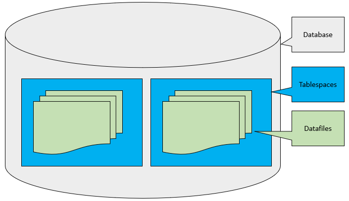

# Oracle Tablespace
**Summary**: In this lab, you will learn about the Oracle tablespace and how Oracle uses tablespaces to logically store the data in the database.

What is an Oracle Tablespace
----------------------------

Oracle divides a database into one or more logical storage units called tablespaces.

Each tablespace consists of one or more files called datafiles. A datafile physically stores the data objects of the database such as tables and [indexes] on disk.

In other words, Oracle **logically** stores data in the tablespaces and **physically** stores data in datafiles associated with the corresponding tablespaces.

The following picture illustrates the relationship between a database, tablespaces, and datafiles:

By using tablespaces, you can perform the following operations:

*   Control the storage size allocated for the database data.
*   grant specific space quotas to the `database users`.
*   Control the availability of data by taking tablespaces online or offline (more on this later).
*   Improve the performance of the database by allocating data storage across devices.
*   Perform partial database backup or recovery.

Default tablespaces in Oracle
-----------------------------

Oracle comes with the following default tablespaces: `SYSTEM`, `SYSAUX`, `USERS`, `UNDOTBS1`, and `TEMP`.

*   The `SYSTEM` and `SYSAUX` tablespaces store system-generated objects such as data dictionary tables. You should not store any object in these tablespaces.
*   The `USERS` tablespace is helpful for ad-hoc users.
*   The `UNDOTBS1` holds the undo data.
*   The `TEMP` is the temporary tablespace that is used for storing intermediate results of sorting, hashing, and large object processing operations.

Online and Offline Tablespaces
------------------------------

A tablespace can be online or offline. If a tablespace is offline, you cannot access data stored in it. On the other hand, if a tablespace is online, its data is available for reading and writing.

Note that the `SYSTEM` tablespace must always be online because it contains the data dictionary that must be available to Oracle.

Normally, a tablespace is online so that its data is available to users. However, you can take a tablespace offline to make data inaccessible to users when you update and maintain the applications.

In case of some errors such as hardware failures, Oracle automatically takes an online tablespace offline. Any attempt to access data in offline tablespace will result in an error.

Read-Only Tablespaces
---------------------

The read-only tablespaces allow Oracle to avoid performing backup and recovery of large, static parts of a database. Because Oracle doesn’t update the files of a read-only tablespace, you can store the files on the read-only media.

Oracle allows you to remove objects such as tables and indexes from a read-only tablespace. However, it does not allow you to create or alter objects in a read-only tablespace.

When you create a new tablespace, it is in the read-write mode. To change a tablespace to a read-only tablespace, you use the `ALTER TABLESPACE` command with the `READ ONLY` option.

More on Oracle Tablespaces
--------------------------

*   [Create tablespace] – show you how to create a new tablespace in the database.
*   [Drop tablespace] – describe the steps of removing a tablespace from the database.
*   [Extend tablespace] – how to extend the size of a tablespace.
*   [Temporary tablespace] – manipulate temporary tablespace effectively.
*   [Tablespace group] – how to use the tablespace group more effectively to optimize internal Oracle operations
