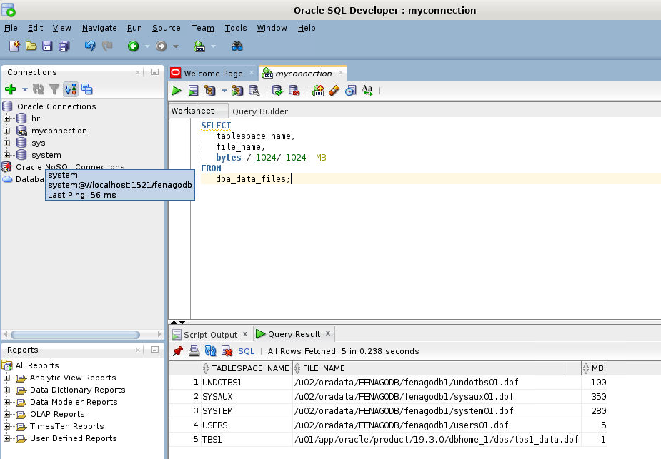

# Oracle CREATE TABLESPACE Statement By Examples
**Summary**: In this lab, you will learn how to use the Oracle `CREATE TABLESPACE` statement to create a new tablespace in a database.

Introduction to the CREATE TABLESPACE statement
-----------------------------------------------

The `CREATE TABLESPACE` statement allows you to create a new tablespace. The following illustrates how to create a new tablespace named `tbs1` with size 1MB:

```
CREATE TABLESPACE tbs1 
   DATAFILE 'tbs1_data.dbf' 
   SIZE 1m;
```


In this statement:

*   First, specify the name of the tablespace after the `CREATE TABLESPACE` keywords. In this example, the tablespace name is `tbs1`.
*   Second, specify the path to the data file of the tablespace in the `DATAFILE` clause. In this case, it is `tbs1_data.dbf`. Note that you can use the datafile full path.
*   Third, specify the size of the tablespace in the `SIZE` clause. In this example, `1m` stands for `1MB`, which is quite small.

Once the tablespace is created, you can find its information by querying data from the `dba_data_files` view:

```
SELECT 
   tablespace_name, 
   file_name, 
   bytes / 1024/ 1024  MB
FROM
   dba_data_files;

```


Here are all the tablespaces in the current database:



The `CREATE TABLESPACE` is quite complex with many options, you can find more information from the Oracle `[CREATE TABLESPACE]` page.

Tablespaces and `CREATE TABLE` statement
----------------------------------------

When you create a new table, Oracle automatically places the table in the default tablespace of the [user] which you use to create the table. However, you can explicitly specify the tablespace to which the table belongs as shown in the following query.

Note that you must have privilege on the tablespace that you specify in the `CREATE TABLE` statement.

Consider the following example.

First, `create a new table` called `t1` whose tablespace is `tbs1`:

```
CREATE TABLE t1(
   id INT GENERATED ALWAYS AS IDENTITY, 
   c1 VARCHAR2(32)
) TABLESPACE tbs1;
```


Second, [insert] 10,000 rows into the `t1` table:

```
BEGIN
   FOR counter IN 1..10000 loop
      INSERT INTO t1(c1)
      VALUES(sys_guid());
   END loop;
END;
/

```


Third, check the free space of the `tbs1` tablespace by querying from the `dba_free_space` view:

```
SELECT 
   tablespace_name, 
   bytes / 1024 / 1024 MB
FROM 
   dba_free_space
WHERE 
   tablespace_name = 'TBS1';

```


Fourth, insert 10,000 rows into the `t1` table, Oracle will issue an error due to insufficient storage in the tablespace:

```
BEGIN
   FOR counter IN 1..10000 loop
      INSERT INTO t1(c1)
      VALUES(sys_guid());
   END loop;
END;
/
```


Here is the error message:

```
ORA-01653: unable to extend table OT.T1 by 8 in tablespace TBS1
```


To fix this, you can resize the tablespace using the following `ALTER DATABASE` statement:

```
ALTER DATABASE
   DATAFILE 'tbs1_data.dbf' 
   RESIZE 10m;
```


If you insert 10,00 rows into the t1 table again, it should work.

The second way to avoid this issue, when creating a new tablespace, you can use the `AUTOEXTEND ON` clause as follows:

```
CREATE TABLESPACE tbs1
   DATAFILE 'tbs1_data.dbf'
   SIZE 1m
   AUTOEXTEND 20m;
```


In this lab, you have learned how to use the Oracle `CREATE TABLESPACE` statement to create a new tablespace.
