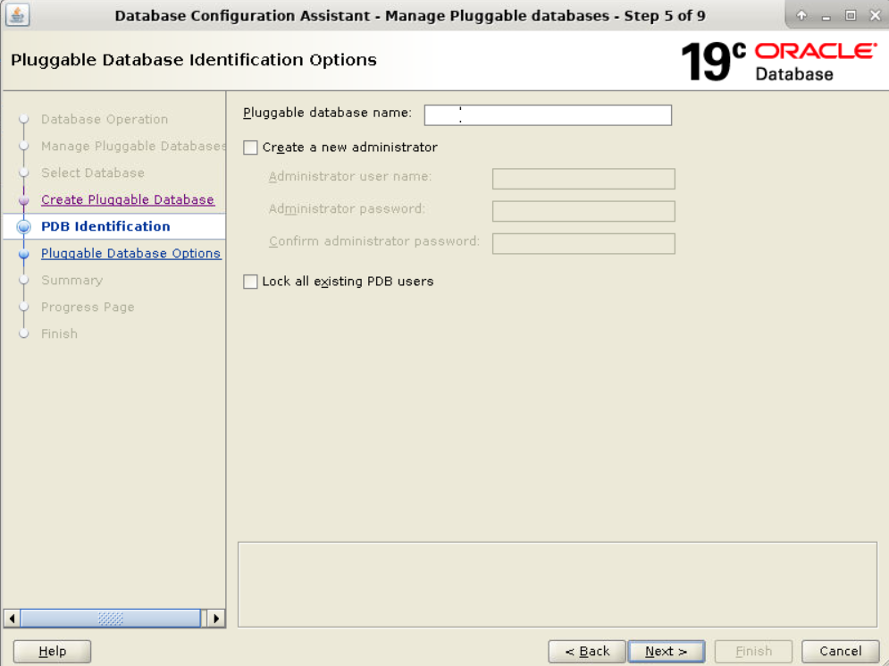

### Practice 5-1: Shutting Down and Starting Up the Oracle Database

#### Objective:
To stop all running databases and listeners, create a new CDB named `CDBLAB` with three PDBs using DBCA, and ensure that all databases are running at the end of the practice.

#### Steps:

1. **Identify and Stop All Running Databases and Listeners**

   First, identify all running databases and listeners:
   ```sh
   xhost +
   su - oracle
   pgrep -lf smon
   pgrep -lf tns
   ```

   Stop all running databases:
   ```sh
   sqlplus / as sysdba
   SHUTDOWN IMMEDIATE;
   ```

   Make sure listener is stopped:
   ```sh
   lsnrctl status
   lsnrctl stop
   ```

   **Important:** Open new terminal and run these commands as **root** user:

   Make sure the `listener.ora` is created. If not, create it:
   ```sh
   cd ~/Desktop
   git clone https://github.com/fenago/oracle19c-administration.git
   cd ~/Desktop/oracle19c-administration

   cp listener.ora /u01/app/oracle/product/19.3.0/dbhome_1/network/admin/

   sudo chown -R oracle /u01/app/oracle/product/19.3.0/dbhome_1/network/admin/listener.ora
   ```


   Make sure listener is running:
   ```sh
   su - oracle
   lsnrctl start
   ```

2. **Set Oracle Environment Variables**

   Set the Oracle environment variables using the `oraenv` script:
   ```sh
   . oraenv
   ORACLE_SID = [oracle] ? CDBLAB
   ```
   Then
    ```bash
    export ORACLE_BASE=/u01/app/oracle
    export ORACLE_HOME=/u01/app/oracle/product/19.3.0/dbhome_1
    export ORACLE_SID=CDBLAB
    export PATH=$ORACLE_HOME/bin:$PATH
    ```

3. **Create a New CDB with Three PDBs Using DBCA**

   Use the following command to create a new CDB named `CDBLAB` with three PDBs (`PDBLAB1`, `PDBLAB2`, and `PDBLAB3`):
   ```sh
    dbca -silent -createDatabase \
   -templateName General_Purpose.dbc \
   -gdbname CDBLAB -sid CDBLAB -responseFile NO_VALUE \
   -characterSet AL32UTF8 \
   -sysPassword fenago \
   -systemPassword fenago \
   -createAsContainerDatabase true \
   -numberOfPDBs 1 \
   -pdbName PDBLAB1 \
   -pdbAdminPassword fenago \
   -databaseType MULTIPURPOSE \
   -memoryMgmtType auto_sga \
   -totalMemory 1536 \
   -storageType FS \
   -datafileDestination "/u01/app/oracle/oradata/" \
   -redoLogFileSize 50 \
   -listeners LISTENER \
   -emConfiguration DBEXPRESS \
   -emExpressPort 5501 \
   -ignorePreReqs
   ```

   Run the command `dbca` to launch the Oracle Database Configuration Assistant.

   In the DBCA welcome screen or main menu, select the "Manage Pluggable Databases" option.
   

   select the "Create a Pluggable Database" option.
   

   DBCA will prompt you to connect to the CDB `CDBLAB`. Provide the necessary credentials.

   **User name**: `sys`
   
   **Password**: `fenago`

   

   Click **Create a new pluggable database from another PDB**, Choose `PDBLAB1` from dropdown and create `PDBLAB2` and `PDBLAB3` ony by one.
   

   

   

   

   

   


#### Connecting to PDBs Using SQL Developer
1. **Launch SQL Developer**:
    - Locate and double-click the SQL Developer launcher icon on your desktop.

2. **Create new connections for PDB2_CDBLAB and PDB3_CDBLAB**:
    - **File -> New -> Database Connection...**
    - **Connection Name**: PDB2_CDBLAB
    - **Username**: sys
    - **Password**: fenago
    - **Connection Type**: Basic
    - **Role**: SYSDBA
    - **Hostname**: localhost
    - **Port**: 1521
    - **Service Name**: pdblab2

   

    Repeat the same steps for PDB3_CDBLAB:
    - **Connection Name**: PDB3_CDBLAB
    - **Username**: sys
    - **Password**: fenago
    - **Connection Type**: Basic
    - **Role**: SYSDBA
    - **Hostname**: localhost
    - **Port**: 1521
    - **Service Name**: pdblab3

3. **Test and Save the Connections**:
    - Click the **Test** button to verify the connection details.
    - Click the **Save** button to save the connection.
    - Click the **Connect** button to establish the connection to PDB1 and PDB2.

#### Manage PDBs in SQL Developer
- **Explore the PDBs**:
    - In the **Connections** pane, expand `PDB1_CDBLAB` and `PDB2_CDBLAB` to explore tables, views, and other database objects.


4. **Verify the CDB and PDBs Creation**

   Connect to the CDB and verify the creation of the PDBs:
   ```sh
   sqlplus / as sysdba
   SELECT con_id, name, open_mode FROM v$pdbs;
   ```

5. **Start and Stop the CDB and PDBs**

   **Shutdown the CDB:**
   ```sql
   SHUTDOWN IMMEDIATE;
   ```

   **Startup the CDB in NOMOUNT Mode:**
   ```sql
   STARTUP NOMOUNT;
   ```

   **Mount the CDB:**
   ```sql
   ALTER DATABASE MOUNT;
   ```

   **Open the CDB:**
   ```sql
   ALTER DATABASE OPEN;
   ```

   **Open All PDBs:**
   ```sql
   ALTER PLUGGABLE DATABASE ALL OPEN;
   ```

   Verify the status of the PDBs:
   ```sql
   SELECT con_id, name, open_mode FROM v$pdbs;
   ```

6. **Set the PDB Save States**

   Save the state of the PDBs so they open automatically on CDB startup:
   ```sql
   ALTER PLUGGABLE DATABASE ALL SAVE STATE;
   ```

7. **Check the PDB Save States**

   Verify the saved states:
   ```sql
   SELECT con_id, con_name, state FROM DBA_PDB_SAVED_STATES;
   ```

8. **Stop the CDB**

   Shut down the CDB:
   ```sql
   SHUTDOWN IMMEDIATE;
   ```

9. **Start the CDB and Verify PDB States**

   Start the CDB and verify the PDB states:
   ```sql
   STARTUP;
   SELECT con_id, name, open_mode FROM v$pdbs;
   ```

10. **Ensure All PDBs Are Running**

    Ensure all PDBs are open:
    ```sql
    ALTER PLUGGABLE DATABASE ALL OPEN;
    SELECT con_id, name, open_mode FROM v$pdbs;
    ```

11. **Exit SQL*Plus**

    Exit SQL*Plus:
    ```sql
    EXIT;
    ```

12. **Start the Listener**

    Start the Oracle listener:
    ```sh
    lsnrctl start
    ```

### Summary
By following these steps, you will successfully identify and stop all running databases and listeners, create a new CDB named `CDBLAB` with three PDBs, and ensure that all databases are running at the end of the practice. This practice helps in understanding the complete lifecycle management of Oracle databases using DBCA and SQL*Plus commands.

### Addendum: Verifying Created Files and Running Processes

#### Objective:
To verify all the files created for the new CDB (`CDBLAB`) and its three PDBs (`PDBLAB1`, `PDBLAB2`, `PDBLAB3`), and to find the processes that are running for all of them.

#### Steps:

1. **Open a New Terminal**

   Open a new terminal window.

2. **Verify Files Created for CDB and PDBs**

   Navigate to the Oracle datafile destination directory:
   ```sh
   cd /u01/app/oracle/oradata/CDBLAB
   ls -l
   ```

   **Expected Files in `CDBLAB` Directory:**
   - **Control Files:** `control01.ctl`, `control02.ctl`
   - **Redo Log Files:** `redo01.log`, `redo02.log`, `redo03.log`
   - **System Data Files:** `system01.dbf`, `sysaux01.dbf`
   - **Temporary Tablespace:** `temp01.dbf`
   - **Undo Tablespace:** `undotbs01.dbf`
   - **PDB Seed Files:** `pdbseed/system01.dbf`, `pdbseed/sysaux01.dbf`

   **Explanation:**
   - **Control Files:** Essential for database startup, containing metadata about the database structure.
   - **Redo Log Files:** Used for recovery purposes, storing all changes made to the database.
   - **System Data Files:** Contain the core data dictionary and system information.
   - **Temporary Tablespace:** Used for temporary storage of data during SQL operations.
   - **Undo Tablespace:** Stores undo information for transactions.
   - **PDB Seed Files:** Template files for creating new PDBs.

3. **Verify Files for Each PDB**

   Navigate to each PDB's directory and list the files:
   
   For `PDBLAB1`:
   ```sh
   cd /u01/app/oracle/oradata/CDBLAB/PDBLAB1
   ls -l
   ```

   For `PDBLAB2`:
   ```sh
   cd /u01/app/oracle/oradata/CDBLAB/PDBLAB2
   ls -l
   ```

   For `PDBLAB3`:
   ```sh
   cd /u01/app/oracle/oradata/CDBLAB/PDBLAB3
   ls -l
   ```

   **Expected Files in Each PDB Directory:**
   - **System Data File:** `system01.dbf`
   - **Sysaux Data File:** `sysaux01.dbf`
   - **Temporary Tablespace:** `temp01.dbf`
   - **Users Tablespace:** `users01.dbf`

   **Explanation:**
   - **System Data File:** Contains the core data dictionary and system information for the PDB.
   - **Sysaux Data File:** Auxiliary data for the PDB.
   - **Temporary Tablespace:** Temporary storage for SQL operations within the PDB.
   - **Users Tablespace:** Default tablespace for user data within the PDB.

4. **Find Running Processes for the CDB and PDBs**

   Identify all running processes for the CDB and PDBs using the `pgrep` command:
   ```sh
   pgrep -lf smon
   ```

   **Expected Output:**
   - You should see entries like `ora_smon_CDBLAB`, `ora_smon_PDB1`, `ora_smon_PDB2`, and `ora_smon_PDB3`.

   **Explanation:**
   - **SMON Process:** System Monitor process for each database, responsible for instance recovery, cleaning up temporary segments, and other tasks.

   Check the listener process:
   ```sh
   pgrep -lf tns
   ```

   **Expected Output:**
   - You should see an entry like `tnslsnr LISTENER`.

   **Explanation:**
   - **Listener Process:** Manages incoming client connections to the Oracle database.

5. **Detailed Process Information**

   For more detailed information about each process, use the `ps` command:
   ```sh
   ps -ef | grep smon
   ```

   **Explanation:**
   - This command provides detailed information about the `smon` processes, including the user running them, start time, and more.

6. **Checking Database Status in SQL*Plus**

   Connect to SQL*Plus to check the status of the CDB and PDBs:
   ```sh
   sqlplus / as sysdba
   ```

   **Check the Status of the PDBs:**
   ```sql
   SELECT con_id, name, open_mode FROM v$pdbs;
   ```

   **Expected Output:**
   - You should see the following:
     ```
     CON_ID    NAME       OPEN_MODE
     -------   -------    ----------
     2         PDB$SEED   READ ONLY
     3         PDBLAB1       READ WRITE
     4         PDBLAB2       READ WRITE
     5         PDBLAB3       READ WRITE
     ```

   **Explanation:**
   - **PDB$SEED:** Template for creating new PDBs, should be in READ ONLY mode.
   - **PDBLAB1, PDBLAB2, PDBLAB3:** User-defined PDBs, should be in READ WRITE mode.

### Summary
By following these detailed steps, you will verify the files created for the new CDB and its PDBs and identify the running processes associated with them. This addendum ensures a thorough understanding of the Oracle database's file structure and process management.

### Summary: Important Files and Scripts for Managing `CDBLAB` and PDBs

#### Oracle Home Directory Structure

The Oracle Home directory structure is as follows:

```
/u01/app/oracle/product/19.3.0/
└── dbhome_1/
    ├── bin/
    ├── config/
    ├── dbs/
    ├── include/
    ├── inventory/
    ├── javavm/
    ├── jdbc/
    ├── jlib/
    ├── lib/
    ├── network/
    ├── OPatch/
    ├── oracore/
    ├── perl/
    ├── plsql/
    ├── precomp/
    ├── racg/
    ├── rdbms/
    ├── relnotes/
    ├── slax/
    ├── sqlplus/
    ├── srvm/
    ├── suptools/
    ├── uc4/
    ├── ucp/
    └── xdk/
```

#### Important Directories and Files

1. **bin/**:
   - **Location**: `/u01/app/oracle/product/19.3.0/dbhome_1/bin/`
   - **Description**: Contains executable files for Oracle utilities and commands.
   - **Important Files**:
     - `sqlplus`: Command-line tool to connect to the Oracle database.
     - `lsnrctl`: Listener control utility.
     - `dbca`: Database Configuration Assistant.

2. **dbs/**:
   - **Location**: `/u01/app/oracle/product/19.3.0/dbhome_1/dbs/`
   - **Description**: Contains database initialization parameter files and password files.
   - **Important Files**:
     - `initCDBLAB.ora`: Initialization parameter file for `CDBLAB`.
     - `spfileCDBLAB.ora`: Server parameter file for `CDBLAB`.

3. **network/admin/**:
   - **Location**: `/u01/app/oracle/product/19.3.0/dbhome_1/network/admin/`
   - **Description**: Contains network configuration files.
   - **Important Files**:
     - `listener.ora`: Configuration file for Oracle Net Listener.
     - `tnsnames.ora`: Network service names configuration file.
     - `sqlnet.ora`: Oracle Net Services configuration file.

4. **rdbms/admin/**:
   - **Location**: `/u01/app/oracle/product/19.3.0/dbhome_1/rdbms/admin/`
   - **Description**: Contains SQL scripts for database creation, management, and maintenance.
   - **Important Files**:
     - `catalog.sql`: Script to create the Data Dictionary.
     - `catproc.sql`: Script to compile and install the PL/SQL packages.

5. **OPatch/**:
   - **Location**: `/u01/app/oracle/product/19.3.0/dbhome_1/OPatch/`
   - **Description**: Contains the OPatch utility for applying patches to the Oracle software.
   - **Important Files**:
     - `opatch`: OPatch executable file.

#### Datafile Locations

1. **CDBLAB Datafiles**:
   - **Location**: `/u01/app/oracle/oradata/CDBLAB/`
   - **Description**: Contains datafiles, control files, and redo log files for the `CDBLAB`.
   - **Important Files**:
     - `control01.ctl`, `control02.ctl`: Control files.
     - `redo01.log`, `redo02.log`, `redo03.log`: Redo log files.
     - `system01.dbf`: System datafile.
     - `sysaux01.dbf`: SYSAUX tablespace datafile.
     - `temp01.dbf`: Temporary tablespace datafile.
     - `undotbs01.dbf`: Undo tablespace datafile.

2. **PDB Datafiles**:
   - **Locations**:
     - `/u01/app/oracle/oradata/CDBLAB/PDBLAB1/`
     - `/u01/app/oracle/oradata/CDBLAB/PDBLAB2/`
     - `/u01/app/oracle/oradata/CDBLAB/PDBLAB3/`
   - **Description**: Contains datafiles for each PDB.
   - **Important Files**:
     - `system01.dbf`: System datafile for each PDB.
     - `sysaux01.dbf`: SYSAUX tablespace datafile for each PDB.
     - `temp01.dbf`: Temporary tablespace datafile for each PDB.
     - `users01.dbf`: Users tablespace datafile for each PDB.

#### Verification and Management Scripts

1. **Verify Database Status**:
   - **Command**: `SELECT con_id, name, open_mode FROM v$pdbs;`
   - **Description**: Checks the status of all PDBs within the CDB.

2. **Shutdown and Startup Commands**:
   - **Shutdown**:
     ```sql
     SHUTDOWN IMMEDIATE;
     ```
   - **Startup**:
     ```sql
     STARTUP;
     ```

3. **Managing PDBs**:
   - **Open a PDB**:
     ```sql
     ALTER PLUGGABLE DATABASE PDBLAB1 OPEN;
     ```
   - **Close a PDB**:
     ```sql
     ALTER PLUGGABLE DATABASE PDBLAB1 CLOSE IMMEDIATE;
     ```

### Summary
This summary highlights the key directories and files necessary for managing the `CDBLAB` and its PDBs. Understanding the location and purpose of these files and directories is crucial for effective database administration and maintenance.

### Addendum: Shutting Down and Restarting a Single PDB

#### Objective:
To provide detailed steps for shutting down and restarting a single Pluggable Database (PDB) within a Container Database (CDB).

#### Steps:

1. **Set Oracle Environment Variables**

   Set the Oracle environment variables using the `oraenv` script:
   ```sh
   . oraenv
   ORACLE_SID = [oracle] ? CDBLAB
   ```

2. **Connect to SQL*Plus as SYSDBA**

   Start SQL*Plus and log in to the database as the SYS user with the SYSDBA privilege:
   ```sh
   sqlplus / as sysdba
   ```

3. **Check the Status of the PDBs**

   Before shutting down a PDB, check the current status of all PDBs:
   ```sql
   SELECT con_id, name, open_mode FROM v$pdbs;
   ```

   **Expected Output:**
   ```
   CON_ID    NAME       OPEN_MODE
   -------   -------    ----------
   2         PDB$SEED   READ ONLY
   3         PDBLAB1       READ WRITE
   4         PDBLAB2       READ WRITE
   5         PDBLAB3       READ WRITE
   ```

4. **Switch to the PDB**

   Switch to the PDB you want to shut down. For example, to switch to `PDBLAB1`:
   ```sql
   ALTER SESSION SET CONTAINER = PDBLAB1;
   ```

5. **Shutdown the PDB**

   Shut down the PDB using the `CLOSE` command:
   ```sql
   ALTER PLUGGABLE DATABASE CLOSE IMMEDIATE;
   ```

   **Verify the PDB Status:**
   ```sql
   SELECT name, open_mode FROM v$pdbs WHERE name = 'PDBLAB1';
   ```

   **Expected Output:**
   ```
   NAME    OPEN_MODE
   ------  ----------
   PDBLAB1    MOUNTED
   ```

   **Explanation:**
   - The PDB `PDBLAB1` should now be in the MOUNTED state, indicating it is closed but not completely shut down.

6. **Restart the PDB**

   To restart the PDB, open it:
   ```sql
   ALTER PLUGGABLE DATABASE OPEN;
   ```

   **Verify the PDB Status:**
   ```sql
   SELECT name, open_mode FROM v$pdbs WHERE name = 'PDBLAB1';
   ```

   **Expected Output:**
   ```
   NAME    OPEN_MODE
   ------  ----------
   PDBLAB1    READ WRITE
   ```

   **Explanation:**
   - The PDB `PDBLAB1` should now be in the READ WRITE state, indicating it is fully operational.

7. **Return to the Root Container**

   After managing the PDB, return to the root container (`CDB$ROOT`):
   ```sql
   ALTER SESSION SET CONTAINER = CDB$ROOT;
   ```

8. **Exit SQL*Plus**

   Exit SQL*Plus:
   ```sql
   EXIT;
   ```

### Summary
By following these steps, you can effectively shut down and restart a single PDB within a CDB. This procedure is essential for performing maintenance tasks or managing specific PDBs without affecting the entire CDB.
-----
```
SID_LIST_LISTENER =
  (SID_LIST =
    (SID_DESC =
      (GLOBAL_DBNAME = pdblab2)
      (SID_NAME = PDBLAB2)
      (ORACLE_HOME = /u01/app/oracle/product/19.3.0/dbhome_1)
    )
    (SID_DESC =
      (GLOBAL_DBNAME = pdblab3)
      (SID_NAME = PDBLAB3)
      (ORACLE_HOME = /u01/app/oracle/product/19.3.0/dbhome_1)
    )
  )
```


this
```
PDBLAB2 =
  (DESCRIPTION =
    (ADDRESS = (PROTOCOL = TCP)(HOST = localhost)(PORT = 1521))
    (CONNECT_DATA =
      (SERVER = DEDICATED)
      (SERVICE_NAME = pdblab2)
    )
  )

PDBLAB3 =
  (DESCRIPTION =
    (ADDRESS = (PROTOCOL = TCP)(HOST = localhost)(PORT = 1521))
    (CONNECT_DATA =
      (SERVER = DEDICATED)
      (SERVICE_NAME = pdblab3)
    )
  )
```
