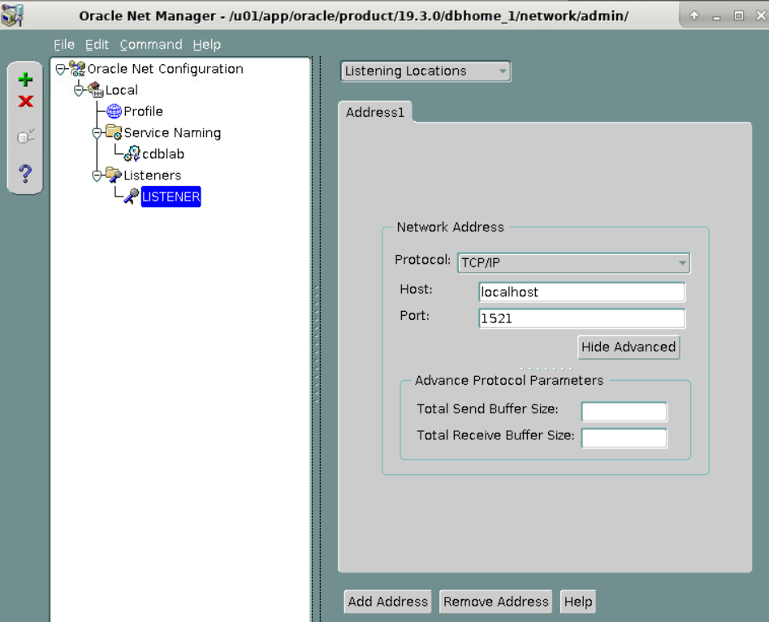
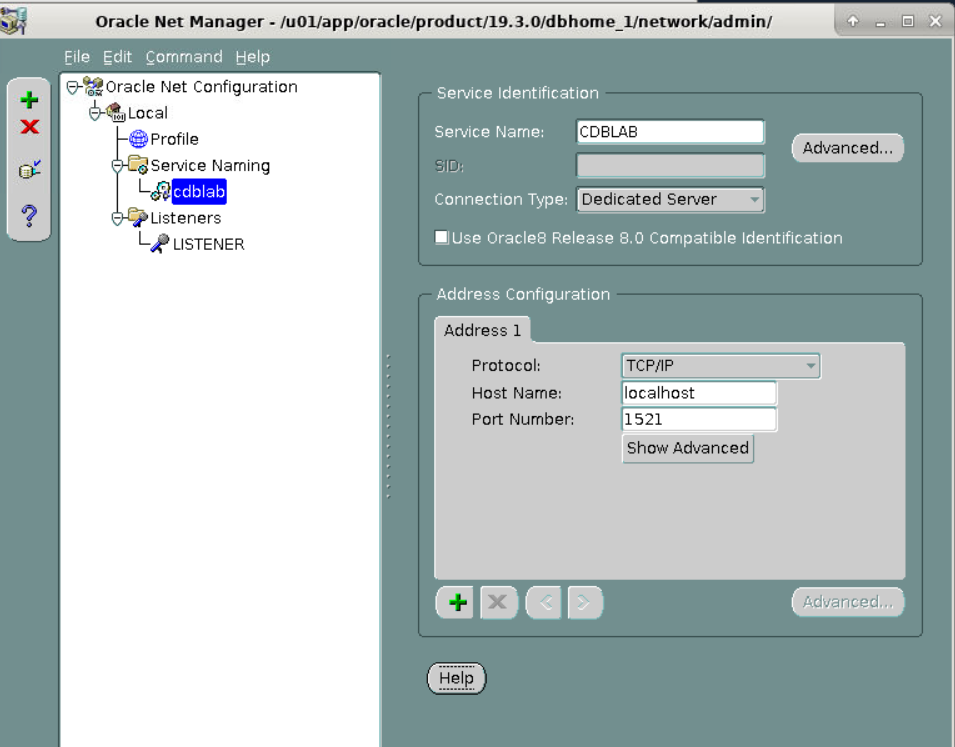
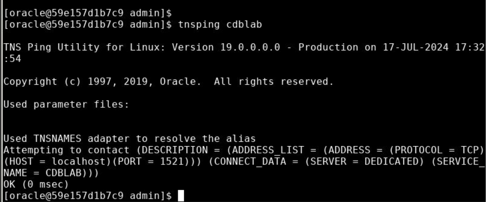

### Oracle Database - Using Netmgr


## Introduction
In this lab, you will explore Oracle Network Manager (`netmgr`) to understand the configuration of existing network components in an Oracle 19c database. Specifically, you will:
- Explore a pre-configured listener named `Listener`.
- Explore a pre-configured service naming for `cdblab`.

## Prerequisites
- Oracle 19c installed and running.
- Basic understanding of Oracle networking concepts.
- Access to the Oracle Net Manager tool (`netmgr`).
- Pre-configured listener named `Listener` and service naming `cdblab`.

### Steps:

1. **Open a Terminal and Set Environment to `CDBLAB`**

   Open a terminal and set your environment to your database SID to `CDBLAB`:
   ```sh
   export ORACLE_SID=CDBLAB
   ```

2. **Verify the Databases `orclcdb` is in `/etc/oratab`**

   Verify the presence of `orclcdb` in the `/etc/oratab` file:
   ```sh
   more /etc/oratab
   ```

   **Expected Output:**
   ```
   orclcdb:/u01/app/oracle/product/19.3.0/dbhome_1:N
   ...
   CDBLAB:/u01/app/oracle/product/19.3.0/dbhome_1:N
   ```

3. **Invoke Oracle Net Manager to Create the `testorcl` Net Service**

   Start Oracle Net Manager:
   ```sh
   netmgr
   ```

## Exploring Listener Configuration
1. In the Oracle Net Manager window, expand the `Local` node.
2. Click on `Listeners`.
3. Select the listener named `Listener`.
4. Review the configuration details such as:
    - **Protocol**: Should be set to TCP.
    - **Host**: The hostname or IP address of your Oracle server.
    - **Port**: Should be 1521 (default).

### Steps:
1. In the Oracle Net Manager window, expand the `Local` node.
2. Click on `Listeners`.
3. Click on the listener named `Listener`.
4. Navigate through the tabs to view configuration details:
    - **General**: Shows the listener name, protocol, host, and port.
    - **Listening Locations**: Provides details on where the listener is listening.
    - **Database Services**: Lists the database services associated with the listener.



## Exploring Service Naming
1. In the Oracle Net Manager window, expand the `Service Naming` node.
2. Click on the service naming `cdblab`.
3. Review the configuration details such as:
    - **Protocol**: Should be set to TCP.
    - **Host**: The hostname or IP address of your Oracle server.
    - **Port**: Should be 1521.
    - **Service Name**: Should be `cdblab`.

### Steps:
1. In the Oracle Net Manager window, expand the `Local` node.
2. Click on `Service Naming`.
3. Click on the service naming `cdblab`.
4. Navigate through the tabs to view configuration details:
    - **General**: Shows the service name, protocol, host, and port.
    - **Address**: Provides the connection details for the service.



## Verifying the Configuration
1. Save the configuration by selecting `File` -> `Save Network Configuration` if any changes were made.
2. Open a terminal or command prompt.
3. Use the `lsnrctl` command to check the status of the listener:
    ```bash
    lsnrctl status Listener
    lsnrctl start Listener
    ```
4. Verify that the listener is running and the service `cdblab` is listed.
5. Use the `tnsping` command to verify the service naming:
    ```bash
    tnsping cdblab
    ```
    
