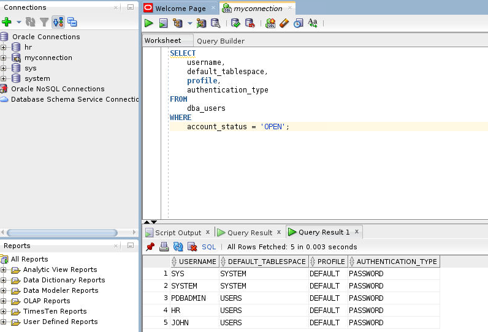
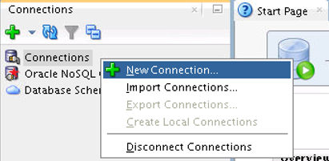
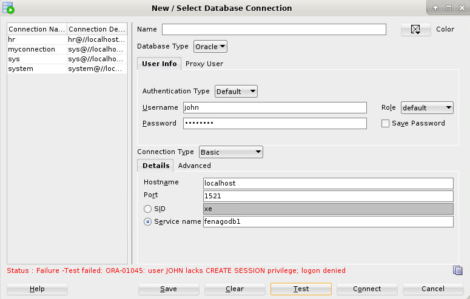
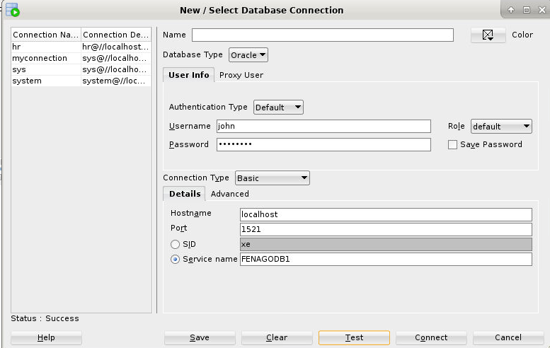
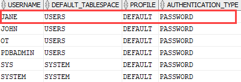
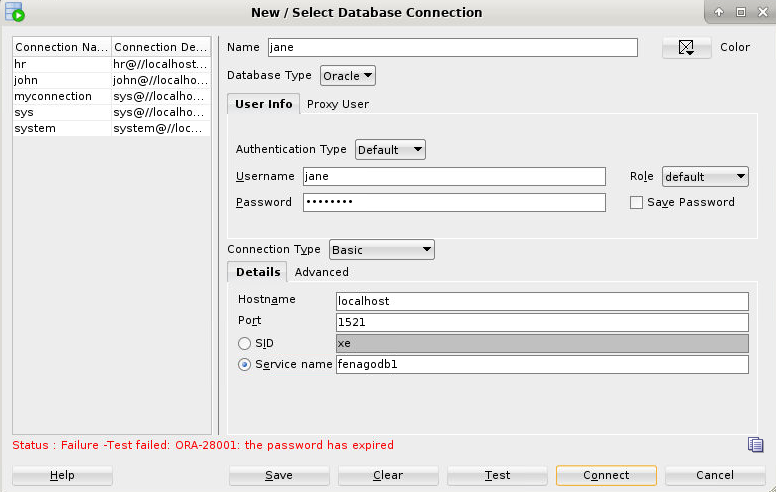

# Oracle CREATE USER: Create a New User in The Oracle Database
**Summary**: In this lab, you will learn how to use the Oracle `CREATE USER` statement to create a new user in the Oracle database.

Oracle CREATE USER statement
-----------------------------

The `CREATE USER` statement allows you to create a new database user which you can use to log in to the Oracle database.

The basic syntax of the `CREATE USER` statement is as follows:

```
 CREATE USER username
    IDENTIFIED BY password
    [DEFAULT TABLESPACE tablespace]
    [QUOTA {size | UNLIMITED} ON tablespace]
    [PROFILE profile]
    [PASSWORD EXPIRE]
    [ACCOUNT {LOCK | UNLOCK}];
```


In this syntax:

### `CREATE USER` username

Specify the name of the user to be created.

### `IDENTIFIED BY` password

Specify a password for the local user to use to log on to the database. Note that you can create an external or global user, which is not covered In this lab.

### `DEFAULT TABLESPACE`

Specify the `tablespace` of the objects such as tables and views that the user will create.

If you skip this clause, the user’s objects will be stored in the database default tablespace if available, typically it is `USERS` tablespace; or the `SYSTEM` tablespace in case there is no database default tablespace.

### `QUOTA`

Specify the maximum space in the tablespace that the user can use. You can have multiple `QUOTA` clauses, each for a tablespace.

Use `UNLIMITED` if you don’t want to restrict the size of the tablespace that the user can use.

### `PROFILE` profile

A [user profile] limits the database resources or password that the user cannot exceed. You can assign a profile to a newly created user. If you skip this clause, Oracle will assign the `DEFAULT` profile to the user.

### `PASSWORD EXPIRE`

Use the `PASSWORD EXPIRE` if you want to force the user to change the password for the first time the user logs in to the database.

### `ACCOUNT {LOCK | UNLOCK}`

Use `ACCOUNT LOCK` if you want to lock the user and disable access. On the other hand, specify `ACCOUNT UNLOCK` to unlock user and enable access.

To execute the `CREATE USER` statement, you must have the `CREATE USER` system privilege. Once you create the new user, the privilege domain of the user will be empty.

Therefore, if you want the user to be able to login to the database, you should grant the `CREATE SESSION` system privilege to the user.

Oracle `CREATE USER` examples
-----------------------------

Let’s practice with the `CREATE USER` statement.

### 1) Using Oracle `CREATE USER` statement to create a new local user example

This example uses the `CREATE USER` statement to create a new local user named `john` with the password `abcd1234`:

```
CREATE USER john IDENTIFIED BY abcd1234;

```


Oracle issues the following output indicating that the user `john` has been created successfully.

```
User JOHN created.

```


To find a list of users with the `OPEN` status, you query the information from the `dba_users`:

```
SELECT 
    username, 
    default_tablespace, 
    profile, 
    authentication_type
FROM
    dba_users
WHERE 
    account_status = 'OPEN';

```




As you can see from the output, the user `john` has a default tablespace as `USERS`, profile as `DEFAULT`, and log in to the database using a `PASSWORD`.

Let’s use the `john` account to log in to the database.


2.	Create a New Oracle SQL Developer Database Connection

a.	To create a new database connection, in the Connections Navigator, right-click Connections and select New Connection from the context menu.



The New / Select Database Connection dialog box appears.

b.	Create a database connection by using the following information:

i.	Connection Name: **john**

ii.	Username: **john**

iii. Password: **abcd1234**

iv.	Hostname: **localhost**

v.	Port: **1521**

vi.	Service Name: **FENAGODB1**

vii. Role: **default**



Test the connection by clicking `Test` button and then click `Connect` button.
 

Oracle issued the following error:

```
ERROR: ORA-01045: 
user JOHN lacks CREATE SESSION privilege; logon denied
```


To enable the user `john` to log in, you need to grant the `CREATE SESSION` system privilege to the user `john`  by using the following statement:

```
GRANT CREATE SESSION TO john;

```


Now, the user `john` should be able to log in to the database.




### 2) Using Oracle `CREATE USER` statement to create a new local user with password expired

First, use the `CREATE USER` statement to create a new user `jane`:

```
CREATE USER jane IDENTIFIED BY abcd1234 
PASSWORD EXPIRE;
```


Second, verify if the user has been created successfully:

```
SELECT 
    username, 
    default_tablespace, 
    profile, 
    authentication_type
FROM
    dba_users
WHERE 
    account_status = 'OPEN' OR account_status = 'EXPIRED';

```




Third, grant the `CREATE SESSION` privilege to the user `jane` so that you can use this user to log in the Oracle database.

```
GRANT CREATE SESSION TO jane;

```


Finally, use the user `jane` to log in to the database via the SQL developer program:




Run following command as sys user and try to login again with `jane` user:

```
alter user jane IDENTIFIED BY abcd1234 account unlock;
```


In this lab, you have learned how to use the Oracle `CREATE USER` statement to create a new user in the Oracle database.
