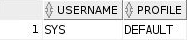
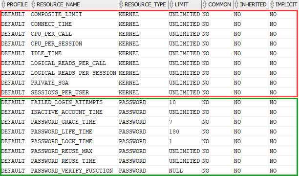
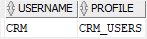

# Oracle CREATE PROFILE: Setting Database Resource & Password Limits
**Summary**: In this lab, you will learn how to use the Oracle `CREATE PROFILE` statement to create a profile for users.

Oracle CREATE PROFILE statement
-----------------------------------------------

A user profile is a set of limits on the database resources and the user password. Once you assign a profile to a user, then that user cannot exceed the database resource and password limits.

The `CREATE PROFILE` statement allows you to create a new user profile. The following illustrates the basic syntax of the `CREATE PROFILE` statement:

```
CREATE PROFILE profile_name
LIMIT { resource_parameters | password_parameters};
```


In this syntax:

*   First, specify the name of the profile that you want to create.
*   Second, specify the `LIMIT` on either database resources or password.

### resource\_parameters

You use the following clauses to set the limit for resource parameters:

*   `SESSIONS_PER_USER` – specify the number of concurrent sessions that a user can have when connecting to the Oracle database.
*   `CPU_PER_SESSION` – specify the CPU time limit for a user session, represented in hundredth of seconds.
*   `CPU_PER_CALL` – specify the CPU time limit for a call such as a parse, execute, or fetch, expressed in hundredths of seconds.
*   `CONNECT_TIME` – specify the total elapsed time limit for a user session, expressed in minutes.
*   `IDLE_TIME` – specify the number of minutes allowed for periods of continuous inactive time during a user session. Note that the long-running queries and other operations will not be subject to this limit.
*   `LOGICAL_READS_PER_SESSION` – specify the allowed number of data blocks read in a user session, including blocks read from both memory and disk.
*   `LOGICAL_READS_PER_CALL` – specify the allowed number of data blocks read for a call to process a SQL statement.
*   `PRIVATE_SGA` – specify the amount of private memory space that a session can allocate in the shared pool of the system’s global area (SGA).
*   `COMPOSITE_LIMIT` – specify the total resource cost for a session, expressed in service units. The total service units are calculated as a weighted sum of `CPU_PER_SESSION`, `CONNECT_TIME`, `LOGICAL_READS_PER_SESSION`, and `PRIVATE_SGA`.

### password\_parameters

You use the following clauses to set the limits for password parameters:

*   `FAILED_LOGIN_ATTEMPTS` – Specify the number of consecutive failed login attempts before the user is locked. The default is 10 times.
*   `PASSWORD_LIFE_TIME` – specify the number of days that a user can use the same password for authentication. The default value is 180 days.
*   `PASSWORD_REUSE_TIME` – specify the number of days before a user can reuse a password.
*   `PASSWORD_REUSE_MAX` – specify the number of password changes required before the current password can be reused. Note that you must set values for both `PASSWORD_REUSE_TIME` and `PASSWORD_REUSE_MAX` parameters make these parameters take effect.
*   `PASSWORD_LOCK_TIME` – specify the number of days that Oracle will lock an account after a specified number of consecutive failed logins. The default is 1 day if you omit this clause.
*   `PASSWORD_GRACE_TIME` – specify the number of days after the grace period starts during which a warning is issued and login is allowed. The default is 7 days when you omit this clause.

Note that to create a new profile, your user needs to have the `CREATE PROFILE` system privilege.

Oracle CREATE PROFILE examples
------------------------------

To find the current profile of a user, you query it from the `dba_users` view as shown in the following statement:

```
SELECT 
    username, 
    profile
FROM 
    dba_users
WHERE 
    username = 'SYS';
```


Here is the output:



So the user `SYS` has the `DEFAULT` profile.

When you create a user without explicitly specifying a profile, Oracle will assign the `DEFAULT` profile to the user.

To find the parameters of `DEFAULT` profile, you query the `dba_profiles` as shown in the following query:

```
SELECT 
  * 
FROM 
    dba_profiles
WHERE 
    PROFILE = 'DEFAULT'
ORDER BY 
    resource_type, 
    resource_name;

```


Here is the output:



### 1) Using Oracle CREATE PROFILE to set the resource limit example

First, create a profile called `CRM_USERS` that set the resource limits:

```
CREATE PROFILE CRM_USERS LIMIT 
    SESSIONS_PER_USER          UNLIMITED
    CPU_PER_SESSION            UNLIMITED 
    CPU_PER_CALL               3000 
    CONNECT_TIME               15;

```


Second, create a user called `CRM`:

```
CREATE USER crm IDENTIFIED BY abcd1234
PROFILE crm_users;
```


Third, verify the profile of the `CRM` user:

```
SELECT 
    username, 
    profile
FROM 
    dba_users
WHERE 
    username = 'CRM';
```




The user `CRM` is subject to the following limits: the `CRM` user can have any number of concurrent sessions (`SESSIONS_PER_USER`). In each session, it can consume any amount of CPU time (`CPU_PER_SESSION`). In addition, the `CRM` user cannot consume more than 30 seconds of CPU time in a single call. (`CPU_PER_CALL`) and each session cannot last for more than 15 minutes.

### 2) Using Oracle CREATE PROFILE to set the password limit example

First, create a new profile called `erp_users` with password limits:

```
CREATE PROFILE erp_users LIMIT
    FAILED_LOGIN_ATTEMPTS 5
    PASSWORD_LIFE_TIME 90;

```


Then, create a user named `sap` and set its profile to `erp_users`:

```
CREATE USER sap IDENTIFIED BY abcd1234
PROFILE erp_users;
```


The `sap` user is subject to the following password limits:

*   The number of consecutive failed login attempts (`FAILED_LOGIN_ATTEMPTS`) is 5 before the account is locked.
*   The number of days to change the password is 90 days.

In this lab, you’ve learned how to use Oracle `CREATE PROFILE` to set resource and password limits to users.
