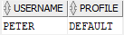

# Oracle DROP PROFILE Statement

**Summary**: In this lab, you will learn how to use the Oracle `DROP PROFILE` statement to delete a user profile from the database.

Oracle DROP PROFILE Statement
-------------------------------------------------

The `DROP PROFILE` statement allows you to delete a profile from the Oracle database. Here is the basic syntax of the `DROP PROFILE` statement:

```
DROP PROFILE profile_name [CASCADE];
```


In this syntax:

*   First, specify the name of the profile that you want to delete after the `DROP PROFILE` keywords.
*   Then, optionally use the `CASCADE` keyword if you want to de-assign the profile from all users who have been assigned the profile. Oracle will automatically assign the `DEFAULT` profile to these users.

Note that if the profile has been assigned to one user, you must use the `CASCADE` option to delete the profile. In addition, you can delete any profile except for the `DEFAULT` profile.

Oracle DROP PROFILE examples
----------------------------

Let’s take some examples of using the `DROP PROFILE` statement to remove a profile from the Oracle database.

### 1) Using the Oracle DROP PROFILE to delete a profile that has not been assigned to any user

First, [create a new profile] named `mobile_app`:

```
CREATE PROFILE mobile_app LIMIT 
    PASSWORD_LIFE_TIME UNLIMITED;

```


Then, use the `DROP PROFILE` statement to delete the `mobile_app` profile:

```
DROP PROFILE mobile_app;

```


### 2) Using the Oracle DROP PROFILE to delete a profile with the `CASCADE` option

First, create a new profile called `db_manager`:

```
CREATE PROFILE db_manager LIMIT
    FAILED_LOGIN_ATTEMPTS 5
    PASSWORD_LIFE_TIME 1;

```


Next, create a user called `peter` and assign the `db_manager` profile to the user:

```
CREATE USER peter IDENTIFIED BY abcd1234
    PROFILE db_manager;

```


Then, attempt to drop the `db_manager` profile:

```
DROP PROFILE db_manager;
```


Oracle issued the following error:

```
ORA-02382: profile DB_MANAGER has users assigned, cannot drop without CASCADE
```


After that, use the `CASCADE` option in the `DROP PROFILE` statement to delete the `db_manager` profile:

```
DROP PROFILE db_manager CASCADE;
```


Finally, view the profile of the user `peter`:

```
SELECT username, profile
FROM dba_users
WHERE username = 'PETER';

```




Oracle automatically assigned the `DEFAULT` profile to the user `peter` as expected.

In this lab, you’ve learned how to use the `DROP PROFILE` statement to remove a profile from the Oracle Database.
