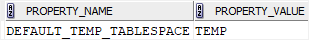
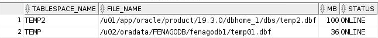

# Oracle Temporary Tablespaces

**Summary**: In this lab, you will learn about the Oracle temporary tablespaces and how to manipulate the temporary tablespaces effectively.

Oracle Temporary Tablespaces
----------------------------

A temporary tablespace, as its name implies, stores the temporary data that only exists during the database session.

Oracle uses temporary tablespaces to improve the concurrency of multiple [sort operations] that do not fit in memory. On top of this, Oracle stores temporary tables, temporary indexes, temporary B-trees, and temporary LOBs in temporary tablespaces.

By default, Oracle creates a single temporary tablespace named `TEMP` for each new Oracle Database installation. This `TEMP` tablespace can be shared by multiple users.

Besides the `TEMP` default temporary tablespace, you can create additional temporary tablespaces and assign them to a user using the `CREATE USER` or `ALTER USER` statement.

Oracle default temporary tablespace
-----------------------------------

When you create a user without specifying a temporary tablespace, Oracle assigns the default temporary tablespace `TEMP` to user. If you want to change the default temporary tablespace, you can use the following command:

```
ALTER DATABASE DEFAULT TEMPORARY TABLESPACE tablespace_name;
```


To find the current default temporary tablespace, you execute the following statement:

```
SELECT 
    property_name, 
    property_value 
FROM 
    database_properties 
WHERE 
    property_name='DEFAULT_TEMP_TABLESPACE';

```


Here is the output:



Viewing space allocation in a temporary tablespace
--------------------------------------------------

This statement returns the space allocated and free space in a temporary tablespace:

```
SELECT * FROM dba_temp_free_space;
```


Creating a temporary tablespace
-------------------------------

To create a new temporary tablespace, you use the `CREATE TEMPORARY TABLESPACE` statement.


Oracle default tablespace examples
----------------------------------

First, create a new temporary tablespace named `temp2` with the size of 100MB:

```
CREATE TEMPORARY TABLESPACE temp2
    TEMPFILE 'temp2.dbf'
    SIZE 100m;
```


Next, find all temporary tablespaces in the current Oracle Database:

```
SELECT
    tablespace_name, 
    file_name, 
    bytes/1024/1024 MB, 
    status
FROM 
    dba_temp_files;

```




Then, check which tablespace is the default temporary tablespace:

```
SELECT 
    property_name, 
    property_value 
FROM 
    database_properties 
WHERE 
    property_name='DEFAULT_TEMP_TABLESPACE';

```


After that, change the default temporary tablespace name to `temp2`:

```
ALTER DATABASE DEFAULT TEMPORARY TABLESPACE temp2;
```


Finally, drop the `temp2` tablespace:

```
DROP TABLESPACE temp2 INCLUDING CONTENTS AND DATAFILES;

```


Oracle issued the following error:

```
SQL Error: ORA-12906: cannot drop default temporary tablespace

```


You cannot drop the default temporary tablespace. To delete the `temp2` tablespace as the default temporary tablespace, you must first change the default tablespace back to the `TEMP` tablespace:

```
ALTER DATABASE DEFAULT TEMPORARY TABLESPACE temp;

```


And then drop the `temp2` temporary tablespace:

```
DROP TABLESPACE temp2 INCLUDING CONTENTS AND DATAFILES;
```


In this lab, you have learned about the Oracle temporary tablespaces and how to manipulate them effectively.
