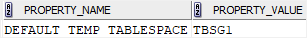

# An Essential Guide to Oracle Tablespace Group

**Summary**: In this lab, you will learn about Oracle temporary tablespace group and how to use the tablespace group effectively to optimize internal Oracle operations.

Oracle tablespace groups
------------------------

A tablespace group typically consists of multiple `temporary tablespaces`. A tablespace group allows a user to consume temporary space from multiple temporary tablespaces, instead of a single temporary tablespace. By using a tablespace group, you can avoid the problem caused when one temporary tablespace does not have enough space to hold the results of a sort.

The following describes the property of a tablespace group:

*   A tablespace group must contain at least one `temporary tablespace`.
*   The name of a tablespace group cannot be the same as any `tablespace`.
*   A tablespace group can be assigned as a _default temporary tablespace_ for the database or a temporary tablespace for a user.

Creating a tablespace group
---------------------------

Oracle does not provide a statement to create a tablespace group explicitly. You create a tablespace group when you assign the first temporary tablespace to the group using the `CREATE TEMPORARY TABLESPACE` statement Or `ALTER TABLESPACE` statement.


Removing a tablespace group
---------------------------

Oracle automatically drops a tablespace group when you remove the last temporary tablespace from the tablespace group.

Viewing tablespace groups
-------------------------

The view `DBA_TABLESPACE_GROUPS` lists all tablespace groups and their member temporary tablespace.

```
SELECT * FROM DBA_TABLESPACE_GROUPS;
```


Oracle tablespace group examples
--------------------------------

First, create a new temporary tablespace and assign it to the tablespace group `tbs1`:

```
CREATE TEMPORARY TABLESPACE temp2 
TEMPFILE 'temp2.dbf' 
SIZE 100M 
TABLESPACE GROUP tbsg1;
```


Because the tablespace group `tbsg1` has not existed, the statement also created the tablespace group `tbsg1`.

Second, assign the temp temporary tablespace `temp` to the `tbsg1` tablespace group:

```
ALTER TABLESPACE temp TABLESPACE GROUP tbsg1;
```


Third, assign the tablespace group gbsg1 as the default temporary tablespace:

```
ALTER DATABASE DEFAULT TEMPORARY TABLESPACE tbsg1;
```


Finally, verify the current default temporary tablespace:

```
SELECT 
    property_name, 
    property_value 
FROM 
    database_properties 
WHERE 
    property_name='DEFAULT_TEMP_TABLESPACE';
```




In this lab, you have learned about the Oracle tablespace group and how to use the tablespace group effectively to optimize internal Oracle operations.
